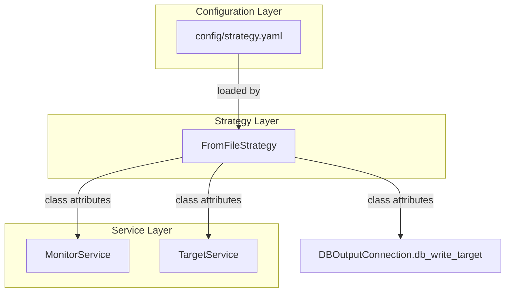

# Design Document: Monitor Initial Odds and Configurable Timing

## Overview

This feature addresses two related issues in the trading system's monitor service:

1. **Missing initial odds** — When a target transitions from IDENTIFIED to OPEN, its `update_frequency` is set to 14400 seconds (4 hours). The monitor's timer-based loop won't fetch odds until that timer elapses, meaning newly-activated targets sit without market data for hours.

2. **Hardcoded timing values** — All polling intervals, the stale cleanup threshold, and the loop break threshold are hardcoded in `monitor_service.py` and `output/dboutput.py`, making it impossible to tune behaviour without code changes.

The solution introduces an immediate odds fetch for newly-opened targets and moves all timing configuration into `config/strategy.yaml`, loaded through the existing `FromFileStrategy` pattern.

## Architecture

The change spans four files across three layers:



**Design decisions:**

1. **Extend existing pattern, don't create new abstractions** — `FromFileStrategy` already loads YAML and sets class-level attributes on `DefaultStrategy`. We add new attributes following the same pattern with `.get()` fallbacks for backwards compatibility.

2. **Immediate fetch as a distinct step** — Rather than modifying the existing `get_filtered_targets` logic, we add a separate method `fetch_odds_for_new_targets` that identifies targets transitioning to OPEN and fetches their odds before entering the timer loop. This keeps the existing polling logic unchanged.

3. **Pass config to `db_write_target`** — Currently `db_write_target` hardcodes `14400`. Rather than making the DB layer depend on strategy, we pass `update_frequency` as a parameter (with a default for backwards compatibility).

## Components and Interfaces

### 1. DefaultStrategy (modified)

New class-level attributes with default values:

```python
class DefaultStrategy:
    # Existing attributes...
    
    # New timing configuration
    UPDATE_FREQUENCY_TIERS = {
        'IN_PLAY': 5,
        'LESS_THAN_3H': 300,
        'LESS_THAN_6H': 900,
        'LESS_THAN_12H': 3600,
        'MORE_THAN_12H': 14400,
    }
    INITIAL_UPDATE_FREQUENCY = 14400
    STALE_TARGET_HOURS = 24
    MONITOR_MAX_WAIT_SECONDS = 900
```

### 2. FromFileStrategy (modified)

Loads new keys from YAML using `.get()` with fallback to `DefaultStrategy` defaults:

```python
class FromFileStrategy(DefaultStrategy):
    def __init__(self):
        # ...existing loading code...
        
        # New timing keys with safe fallbacks
        DefaultStrategy.UPDATE_FREQUENCY_TIERS = yaml_content.get(
            'UPDATE_FREQUENCY_TIERS', DefaultStrategy.UPDATE_FREQUENCY_TIERS
        )
        DefaultStrategy.INITIAL_UPDATE_FREQUENCY = yaml_content.get(
            'INITIAL_UPDATE_FREQUENCY', DefaultStrategy.INITIAL_UPDATE_FREQUENCY
        )
        DefaultStrategy.STALE_TARGET_HOURS = yaml_content.get(
            'STALE_TARGET_HOURS', DefaultStrategy.STALE_TARGET_HOURS
        )
        DefaultStrategy.MONITOR_MAX_WAIT_SECONDS = yaml_content.get(
            'MONITOR_MAX_WAIT_SECONDS', DefaultStrategy.MONITOR_MAX_WAIT_SECONDS
        )
```

### 3. MonitorService (modified)

**New method: `fetch_odds_for_new_targets(targets)`**

Called after `update_target_status()`. Identifies targets that just transitioned from IDENTIFIED to OPEN (those whose status was updated to OPEN in this cycle) and performs an immediate odds fetch + update_frequency assignment for each.

```python
def fetch_odds_for_new_targets(self, raw_targets, processed_targets):
    """
    For targets transitioning IDENTIFIED -> OPEN, immediately fetch odds
    and set update_frequency based on tier config.
    """
    newly_opened = []
    for raw, processed in zip(raw_targets, processed_targets):
        # raw[5] is the DB status (IDENTIFIED), processed[1] is the API status (OPEN)
        if raw[5] == 'IDENTIFIED' and processed[1] == 'OPEN':
            newly_opened.append(processed)
    
    if newly_opened:
        Log.log_info(f"Fetching initial odds for {len(newly_opened)} newly-opened targets")
        self.update_runner_odds(newly_opened)
```

**Modified: `update_runner_odds(targets)`**

Replace hardcoded tier thresholds with values from `self.BF._BFDriver__my_strategy.UPDATE_FREQUENCY_TIERS`:

```python
tiers = DefaultStrategy.UPDATE_FREQUENCY_TIERS
if target_time < now:
    next_update_time_seconds = tiers['IN_PLAY']
elif target_time < now + timedelta(hours=3):
    next_update_time_seconds = tiers['LESS_THAN_3H']
elif target_time < now + timedelta(hours=6):
    next_update_time_seconds = tiers['LESS_THAN_6H']
elif target_time < now + timedelta(hours=12):
    next_update_time_seconds = tiers['LESS_THAN_12H']
else:
    next_update_time_seconds = tiers['MORE_THAN_12H']
```

**Modified: `run()` method**

- Stale cleanup uses `DefaultStrategy.STALE_TARGET_HOURS` instead of hardcoded `'24 hours'`
- Loop break uses `DefaultStrategy.MONITOR_MAX_WAIT_SECONDS` instead of hardcoded `900`
- Calls `fetch_odds_for_new_targets` after `update_target_status`

### 4. target_service.py / DBOutputConnection.db_write_target (modified)

**Option chosen:** Add an `update_frequency` parameter to `db_write_target` with a default of `DefaultStrategy.INITIAL_UPDATE_FREQUENCY`:

```python
def db_write_target(self, target_id, event_id, market_id, runner_ids, 
                    start_time, status, update_frequency=None, notes="None"):
    if update_frequency is None:
        update_frequency = 14400  # legacy default
    # ... use update_frequency in INSERT
```

`target_service.py` passes the configured value:

```python
db_connection.db_write_target(
    ...,
    update_frequency=DefaultStrategy.INITIAL_UPDATE_FREQUENCY,
    ...
)
```

### 5. config/strategy.yaml (extended)

```yaml
# Timing configuration
UPDATE_FREQUENCY_TIERS:
  IN_PLAY: 5
  LESS_THAN_3H: 300
  LESS_THAN_6H: 900
  LESS_THAN_12H: 3600
  MORE_THAN_12H: 14400

INITIAL_UPDATE_FREQUENCY: 14400
STALE_TARGET_HOURS: 24
MONITOR_MAX_WAIT_SECONDS: 900
```

## Data Models

### Strategy Configuration Schema

The new YAML keys added to `config/strategy.yaml`:

| Key | Type | Default | Description |
|-----|------|---------|-------------|
| `UPDATE_FREQUENCY_TIERS` | dict | See below | Maps tier names to polling interval in seconds |
| `UPDATE_FREQUENCY_TIERS.IN_PLAY` | int | 5 | Polling interval when event has started |
| `UPDATE_FREQUENCY_TIERS.LESS_THAN_3H` | int | 300 | Polling interval when <3h to event start |
| `UPDATE_FREQUENCY_TIERS.LESS_THAN_6H` | int | 900 | Polling interval when 3-6h to event start |
| `UPDATE_FREQUENCY_TIERS.LESS_THAN_12H` | int | 3600 | Polling interval when 6-12h to event start |
| `UPDATE_FREQUENCY_TIERS.MORE_THAN_12H` | int | 14400 | Polling interval when >12h to event start |
| `INITIAL_UPDATE_FREQUENCY` | int | 14400 | Seconds assigned to new targets' `update_frequency` column |
| `STALE_TARGET_HOURS` | int | 24 | Hours after event start before marking target EXPIRED |
| `MONITOR_MAX_WAIT_SECONDS` | int | 900 | Max seconds into the future the monitor loop will wait before breaking |

### Database Schema (unchanged)

The `bf.target` table schema remains unchanged. The `update_frequency` column already exists and stores seconds as an integer. The `last_updated` column already stores a UTC timestamp. No migration is needed.

### Target Tuple Structure (in-memory)

The processed targets tuple used throughout `monitor_service.py`:

```
(market_id, status, runner_count, runner_list, update_frequency, last_updated, start_time)
 index: 0       1          2           3              4              5            6
```

This structure is unchanged by this feature.


## Correctness Properties

*A property is a characteristic or behavior that should hold true across all valid executions of a system — essentially, a formal statement about what the system should do. Properties serve as the bridge between human-readable specifications and machine-verifiable correctness guarantees.*

### Property 1: Tier selection returns the correct interval for any time offset

*For any* valid tier configuration dictionary and *for any* time offset between an event start time and the current time, the tier selection function SHALL return the interval corresponding to the correct time bucket (in-play if offset ≤ 0, LESS_THAN_3H if 0 < offset ≤ 3h, LESS_THAN_6H if 3h < offset ≤ 6h, LESS_THAN_12H if 6h < offset ≤ 12h, MORE_THAN_12H if offset > 12h).

**Validates: Requirements 1.4, 2.3**

### Property 2: Config loading preserves present values and applies defaults for missing keys

*For any* subset of the four new timing keys (`UPDATE_FREQUENCY_TIERS`, `INITIAL_UPDATE_FREQUENCY`, `STALE_TARGET_HOURS`, `MONITOR_MAX_WAIT_SECONDS`) present in a valid strategy YAML file, the loaded strategy SHALL have attributes matching the provided values for present keys, and attributes matching the documented defaults for absent keys.

**Validates: Requirements 2.2, 2.5, 3.3, 4.3, 5.3, 6.1, 6.2**

### Property 3: Newly-opened target identification selects exactly the correct targets

*For any* list of raw targets with mixed statuses (IDENTIFIED, OPEN) and a corresponding list of processed targets with API-reported statuses, the `fetch_odds_for_new_targets` function SHALL identify exactly those targets where the raw status is IDENTIFIED and the processed status is OPEN — no more, no fewer.

**Validates: Requirements 1.1**

## Error Handling

### API Errors During Initial Fetch

When the Betfair API returns an error during the initial odds fetch for a newly-opened target:

1. The error is logged via `Log.log_warning()` with the target's market ID and error details.
2. Processing continues to the next newly-opened target.
3. The failed target retains its current `update_frequency` and `last_updated` — it will be picked up in the next regular polling cycle.

Implementation: wrap the per-target fetch in a `try/except` block within `fetch_odds_for_new_targets`, rather than letting a single failure abort the entire batch.

### Config Loading Errors

The existing `FromFileStrategy` raises `StrategyException` if the YAML file cannot be read. The new `.get()` calls with defaults mean that:

- A malformed `UPDATE_FREQUENCY_TIERS` (e.g. wrong type) will result in the raw value being assigned. Validation of tier dict structure should log a warning and fall back to defaults if the value is not a dict with the expected keys.
- Missing keys silently use defaults (by design — requirement 6).

### Invalid Tier Values

If `UPDATE_FREQUENCY_TIERS` is present but has missing sub-keys (e.g. `IN_PLAY` is absent), the tier selection code should use `.get()` with the corresponding default value from a hardcoded fallback dict. This prevents `KeyError` at runtime.

## Testing Strategy

### Property-Based Tests (Hypothesis)

The project already uses Hypothesis (see `tests/test_property_dotenv.py`). Three property tests will be added:

| Property | Test File | Min Iterations |
|----------|-----------|----------------|
| Tier selection correctness | `tests/test_property_monitor_config.py` | 100 |
| Config loading with fallbacks | `tests/test_property_monitor_config.py` | 100 |
| Newly-opened target identification | `tests/test_property_monitor_config.py` | 100 |

**Property test tagging format:**
```python
# Feature: monitor-initial-odds-and-config, Property 1: Tier selection returns the correct interval for any time offset
```

**Hypothesis strategies needed:**
- `st.integers(min_value=1, max_value=86400)` for tier interval values
- `st.datetimes(timezones=st.just(timezone.utc))` for event start times
- `st.timedeltas(min_value=timedelta(hours=-2), max_value=timedelta(hours=48))` for time offsets
- `st.fixed_dictionaries(...)` for tier config generation
- `st.lists(st.sampled_from(['IDENTIFIED', 'OPEN']))` for status lists

### Unit Tests (pytest)

| Scenario | Test File |
|----------|-----------|
| API error during initial fetch continues processing | `tests/unit_tests_monitor_service.py` |
| Loop breaks when nearest_update > max_wait | `tests/unit_tests_monitor_service.py` |
| Stale cleanup SQL uses configured hours | `tests/unit_tests_monitor_service.py` |
| db_write_target uses provided update_frequency | `tests/unit_tests_monitor_service.py` |
| target_service passes INITIAL_UPDATE_FREQUENCY | `tests/unit_tests_monitor_service.py` |

### Integration Tests

Not in scope for this feature. The existing manual execution against the Betfair sandbox covers end-to-end behaviour.

### Test Execution

```bash
# Run all tests
pytest tests/ -v

# Run only property tests for this feature
pytest tests/test_property_monitor_config.py -v
```
