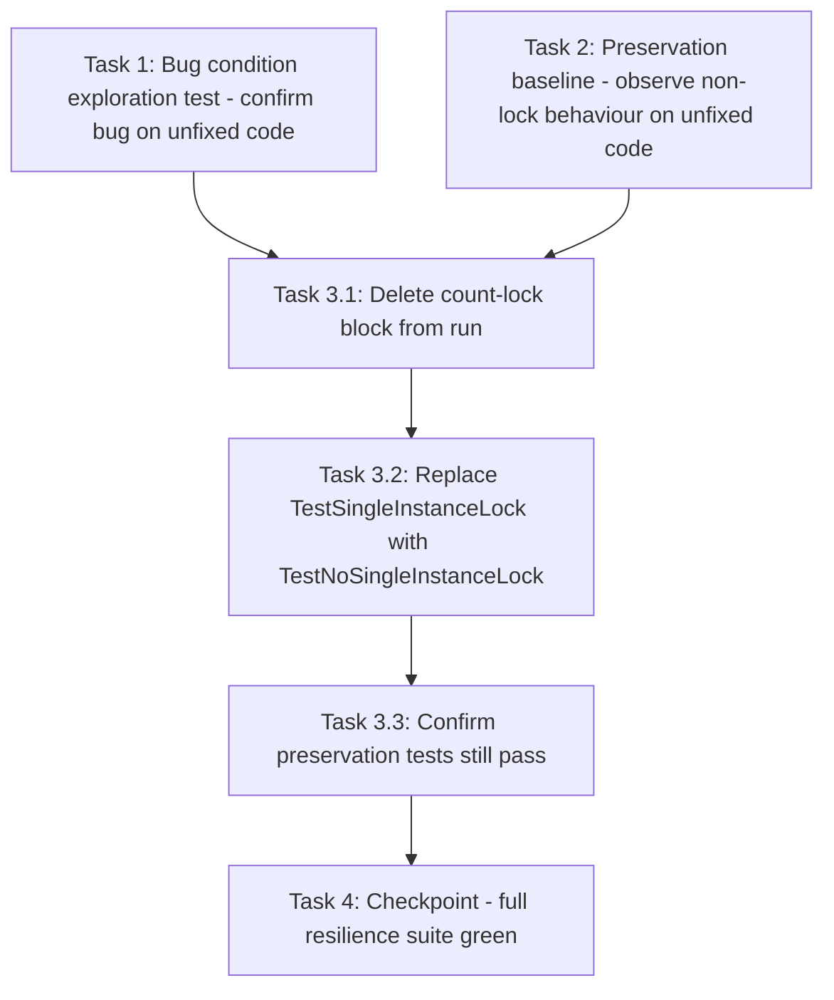

# Implementation Plan

## Overview

This plan implements the **SP-330** fix — "Monitor Service single-instance lock is poisoned permanently by any crashed run". The fix is a **pure deletion**: the count-based single-instance lock block in `MonitorService.run()` (the `for i in range(5):` retry loop with its `db_read` SUM(CASE...) query, the `start_count != finish_count` branch, the warning log, `time.sleep(60)`, and the `Failed to acquire lock` raise) is removed so a run with no live instance is no longer blocked by historical orphaned residue. The only accompanying changes are to tests: replacing `TestSingleInstanceLock` with `TestNoSingleInstanceLock` and confirming the preservation tests still hold.

All tasks reference SP-330. Test file: `tests/unit_tests_monitor_resilience.py`. Runner: project `.venv` pytest (Windows: `& "d:\projects\bf_trader_py\.venv\Scripts\python.exe" -m pytest tests/unit_tests_monitor_resilience.py -v`; Linux/macOS: `.venv/bin/python -m pytest tests/unit_tests_monitor_resilience.py -v`).

## Tasks

- [x] 1. Write bug condition exploration test (BEFORE the fix)
  - **Property 1: Bug Condition** - Orphaned lock residue blocks a run
  - **CRITICAL**: This test MUST FAIL to-be-blocked once the fix lands — but on the UNFIXED code it must confirm the bug. Run it against the current (unfixed) `run()` to reproduce the root cause first.
  - **DO NOT attempt to fix the test or the code when confirming the bug** — the purpose here is only to surface the counterexample.
  - **GOAL**: Surface the Pi counterexample that demonstrates the poisoning on unfixed code.
  - **Scoped PBT Approach**: This is a deterministic bug — scope the property to the concrete failing case: orphaned residue `db_read -> [(231, 230)]` with no live instance.
  - Drive `MonitorService.run()` with a `MagicMock` `DBOutputConnection` patched in, `db_read` returning unequal counts `[(231, 230)]`, and `monitor_service.time.sleep` patched so no real waiting occurs (from Bug Condition: `NOT another_instance_alive AND has_orphaned_lock_residue`).
  - On UNFIXED code assert: `MonitorServiceException("Monitor Service: Failed to acquire lock")` is raised, `time.sleep` was called (retry loop ran), and `Starting run` was NOT written.
  - **EXPECTED OUTCOME (unfixed code)**: Test PASSES / reproduces — confirming the bug exists (a run with no live instance is blocked by historical residue).
  - Document the counterexample: `db_read -> [(231, 230)]`, no live process, `run()` sleeps ~5 min and raises `Failed to acquire lock` without writing `Starting run`.
  - _Requirements: 1.1, 1.2, 1.3_

- [x] 2. Write / confirm preservation property tests (BEFORE implementing fix)
  - **Property 2: Preservation** - Non-lock behaviour unchanged
  - **IMPORTANT**: Follow observation-first methodology — run the UNFIXED code for non-bug-condition cases and record actual behaviour before changing anything.
  - Observe on UNFIXED code: `TestRunFailureLogging.test_failure_writes_failure_record_and_reraises` writes `Starting run` and `Monitor Service: ERROR : Ending run with failure : ...`, then re-raises `MonitorServiceException`.
  - Observe on UNFIXED code: `TestRunFailureLogging.test_failure_logging_never_masks_original_error` — the original exception (`boom`) still propagates (failure logging never masks it, SP-328 Task 11.1).
  - Observe on UNFIXED code: `TestPersistAndContinue` — per-target continue behaviour unchanged.
  - Confirm these existing tests PASS on the unfixed code (they seed a balanced lock count `(5, 5)` purely to pass the old gating — harmless once the lock is gone).
  - Add/confirm an audit-markers-on-success assertion: a run that reaches success writes both `Monitor Service: INFO: Starting run` and `Monitor Service: INFO: Ending run successfully` (from Preservation Requirements, Req 3.1).
  - **EXPECTED OUTCOME**: All preservation tests PASS on UNFIXED code (baseline to preserve).
  - _Requirements: 3.1, 3.2, 3.3_

- [x] 3. Fix: remove the count-based single-instance lock from `MonitorService.run()`

  - [x] 3.1 Delete the count-lock block from `run()`
    - In `monitor_service.py`, remove the entire `for i in range(5):` count-lock block that sits between `self.db_connection.open_connection(db_details_string)` and `self.db_connection.db_write_log("Monitor Service: INFO: Starting run")` (the `db_read` SUM(CASE...) query, the `start_count != finish_count` branch, `Log.log_warning`, `time.sleep(60)`, and the `Failed to acquire lock` raise).
    - After removal `run()` flows directly from `open_connection(...)` to `db_write_log("Monitor Service: INFO: Starting run")`.
    - Keep `import time` at top of file (still used by the capture loop `time.sleep(max(0.1, ...))`).
    - Leave audit markers untouched: `Starting run` and `Ending run successfully` (+ its `Log.log_info`).
    - Leave the top-level failure `except Exception as e:` block (logs `ERROR : Ending run with failure : ...`, re-raises, never masks) untouched.
    - No other edits: stale-target cleanup, auth, capture loop, target filtering, odds capture all unchanged.
    - _Bug_Condition: isBugCondition(X) = (NOT X.another_instance_alive) AND X.has_orphaned_lock_residue (from design)_
    - _Expected_Behavior: run() proceeds — writes "Starting run", no retry sleep, never raises "Failed to acquire lock" (from design)_
    - _Preservation: audit markers, append-only capture, target updates, failure-logging-and-reraise unchanged (from design Preservation Requirements)_
    - _Requirements: 2.1, 2.2, 2.3, 3.1, 3.2, 3.3_

  - [x] 3.2 Replace `TestSingleInstanceLock` with `TestNoSingleInstanceLock`
    - **Property 1: Expected Behavior** - Orphaned lock residue no longer blocks a run
    - Delete `TestSingleInstanceLock` entirely (both `test_second_invocation_is_skipped_and_recorded` and `test_balanced_lock_allows_the_run_to_proceed_past_the_lock` assert removed behaviour).
    - Add `TestNoSingleInstanceLock`: patch `DBOutputConnection` -> mock with `db_read` returning orphaned residue `[(231, 230)]`; patch `BFDriver` so `get_token()` returns `False` (auth fails fast *after* `Starting run`, reaching the marker without running the full capture cycle); patch `monitor_service.time.sleep`.
    - **IMPORTANT**: this is the fix-property test — re-run behaviour from task 1 but now asserting the fixed outcome. Assert: `Starting run` WAS written (`db_write_log` called with `"Monitor Service: INFO: Starting run"`); the raised exception message does NOT contain `Failed to acquire lock`; `time.sleep` was NOT called (no lock retry sleep, capture loop not reached).
    - **EXPECTED OUTCOME**: Test PASSES on fixed code (confirms Property 1 — the bug is fixed).
    - _Requirements: 2.1, 2.2, 2.3_

  - [x] 3.3 Confirm preservation tests still pass unchanged
    - **Property 2: Preservation** - Non-lock behaviour unchanged
    - **IMPORTANT**: Re-run the SAME tests from task 2 — do NOT write new ones (aside from the success-markers assertion already added).
    - Run `TestRunFailureLogging` (both tests) and `TestPersistAndContinue` unchanged.
    - Confirm the audit-markers-on-success assertion still passes.
    - **EXPECTED OUTCOME**: All preservation tests PASS on fixed code (no regressions).
    - _Requirements: 3.1, 3.2, 3.3_

- [x] 4. Checkpoint - Run the full resilience suite and confirm green
  - Run `tests/unit_tests_monitor_resilience.py` via the project `.venv` pytest and confirm all tests pass (`TestNoSingleInstanceLock`, `TestRunFailureLogging`, `TestPersistAndContinue`).
  - If any test fails, ask the user before making further changes.
  - _Requirements: 2.1, 2.2, 2.3, 3.1, 3.2, 3.3_

## Task Dependency Graph

The exploration test (Task 1) and the preservation baseline (Task 2) must both be
written and run against the UNFIXED code before the fix (Task 3) is applied. Within
the fix, the deletion (3.1) comes first, then the fix-property test replacement (3.2),
then the preservation re-confirmation (3.3). The full-suite checkpoint (Task 4) runs
last, once everything else is green.



```json
{
  "waves": [
    {
      "wave": 1,
      "parallel": true,
      "tasks": [
        { "id": "1", "dependsOn": [] },
        { "id": "2", "dependsOn": [] }
      ]
    },
    {
      "wave": 2,
      "parallel": false,
      "tasks": [
        { "id": "3.1", "dependsOn": ["1", "2"] }
      ]
    },
    {
      "wave": 3,
      "parallel": false,
      "tasks": [
        { "id": "3.2", "dependsOn": ["3.1"] }
      ]
    },
    {
      "wave": 4,
      "parallel": false,
      "tasks": [
        { "id": "3.3", "dependsOn": ["3.2"] }
      ]
    },
    {
      "wave": 5,
      "parallel": false,
      "tasks": [
        { "id": "4", "dependsOn": ["3.3"] }
      ]
    }
  ]
}
```

Indented list form:

- Task 1 (bug exploration) ─┐
- Task 2 (preservation baseline) ─┴─> Task 3.1 (delete count-lock block)
  - Task 3.1 -> Task 3.2 (replace lock test with fix-property test)
    - Task 3.2 -> Task 3.3 (confirm preservation tests still pass)
      - Task 3.3 -> Task 4 (checkpoint / full suite)

## Notes

- This work is tracked under **SP-330**; every task references it.
- The fix is a **pure deletion** of the count-based single-instance lock in
  `MonitorService.run()`. There is no data migration, no config change, and no new
  or removed dependency — the only production edit is removing the retry/lock block,
  with `import time` retained for the capture loop.
- Removing this lock retires **SP-328 Req 3.3** (the single-instance lock behaviour)
  for this service; that gating requirement is intentionally no longer enforced by
  `MonitorService`.
