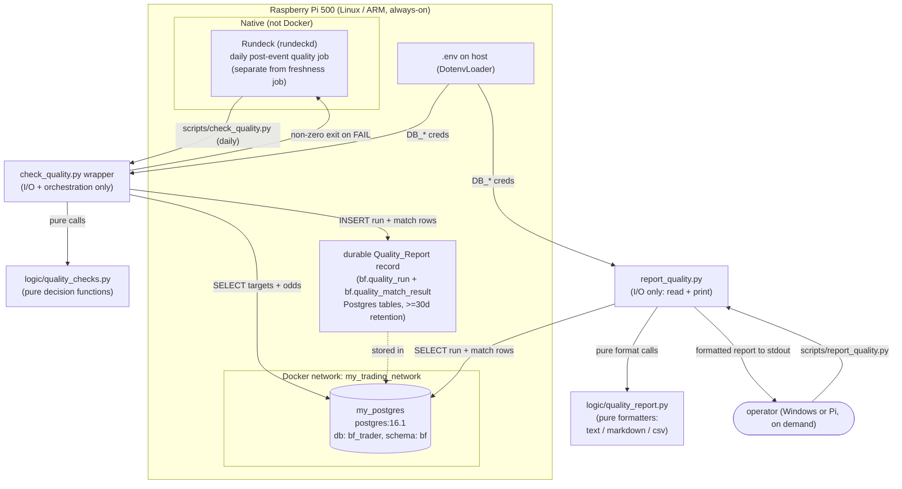
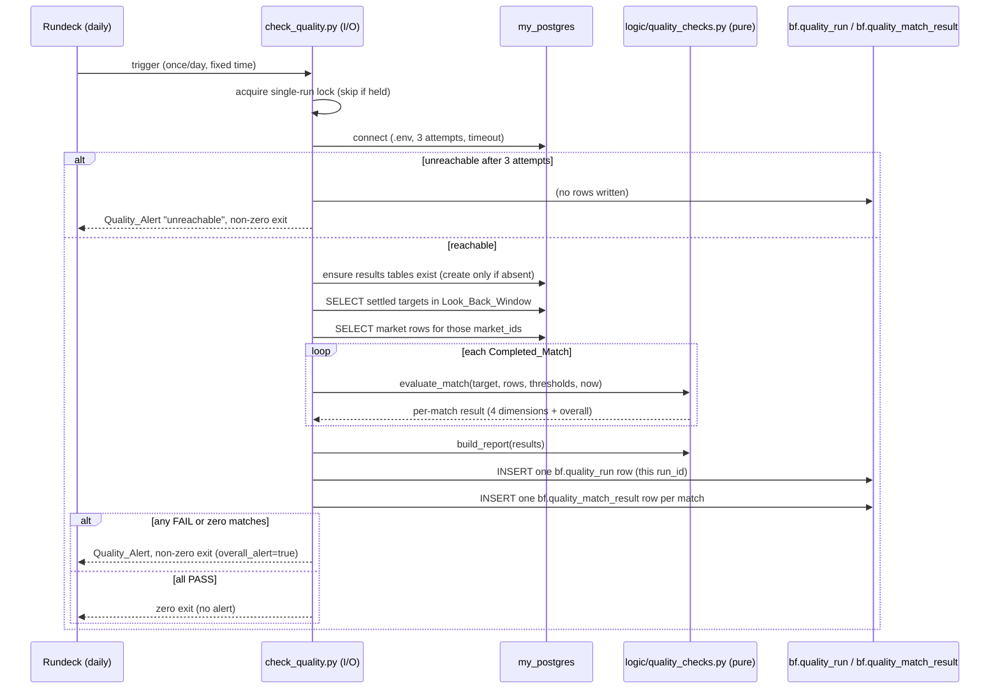

# Design Document

## Overview

This design adds **automated post-event data-quality verification** of captured Betfair odds for completed football matches, under Jira ticket **SP-332** (Side Projects / `bf_trader_py`, label `betfair`). It runs on the always-on Raspberry Pi 500 (Linux/ARM), the sole capture host, against the `my_postgres` Data_Store restored by SP-328.

SP-328 answered the *liveness* question ("is data arriving right now?") with a continuous freshness check. This feature answers a different, complementary question: once a match has finished, **is the captured data present, consistent, and useful** for later analysis? Freshness can be green while the accruing data is quietly worthless — rows landing with every price null because the market was suspended, in-play never sampled, or mid-match gaps from skipped monitor runs. The captured data is perishable and can never be back-filled, so the operator needs a per-match, post-event signal that the data is actually worth analysing, and an alert when a completed match's data is deficient.

The verification runs **post-event** as a **daily** Rundeck job that looks back at recently settled matches, distinct from the every-few-minutes freshness check. It is a **monitoring/alerting signal**, not an on-demand analysis tool: it runs Pi-side on a schedule, records each run's outcome durably, and uses a non-zero exit as the immediate tripwire for the Rundeck run status.

**Three distinct surfaces.** The feature exposes the quality signal through three separate, non-overlapping surfaces, each with its own job:

- **(a) The daily check (`scripts/check_quality.py`)** — the scheduled Rundeck job that evaluates settled matches, writes the durable record to the results tables, and sets a non-zero exit as the failure tripwire. This is the alerting mechanism.
- **(b) The Rundeck one-line stdout summary** — a single readable line printed by the daily check so the Rundeck run output shows the run's headline result at a glance. This stays as the quick console signal and is unchanged.
- **(c) The on-demand report (`scripts/report_quality.py`)** — a separate command the operator runs by hand (from Windows or the Pi) to read the results tables and print a presentable formatted report, with `text` (default), `markdown`, and `csv` output. This is the presentable, human-readable path over the durable record. It performs **no** quality evaluation and never writes to the tables; it only reads and formats. It is distinct from both the daily check (which does the evaluating) and the Rundeck one-line summary (which is only a headline).

**Durable-record decision (resolves Open Question 6).** The durable Quality_Report record is stored as **two Postgres results tables in the `bf` schema** — `bf.quality_run` (one row per run) and `bf.quality_match_result` (one row per verified match) — rather than a JSONL log file. R7.4 permits a Data_Store table as the durable-record form, and tables give the operator per-match, per-dimension history that can be polled and trended over time from Windows or a notebook (a simple `SELECT`), which a flat log file does not. A one-line run summary is still printed to stdout so the Rundeck run output stays readable, but the tables — not any file — are the source of truth. The requirements' Open Questions list can remain as recorded; this design states the resolved decision.

### Design principles

Following the SP-328 anti-over-engineering stance for this solo, learning-adjacent side project:

- **Pure logic in `logic/`, I/O in `scripts/`.** All quality-evaluation decisions are pure functions (no I/O), property-testable and deterministic (Req 9.1). A thin wrapper script does the Data_Store queries and orchestration (Req 9.2), mirroring `scripts/check_freshness.py` and `scripts/verify_db.py`.
- **Reuse the SP-328 alerting pattern.** Logs-only visibility + a durable record + non-zero exit so the Rundeck run status surfaces failures (Req 7). The durable record is a pair of Postgres results tables in the `bf` schema (see below), not a log file. No new notification platform.
- **Reuse the existing connection approach.** `.env` via `DotenvLoader`, direct `psycopg2` with a connect timeout (Req 9.3). No hard-coded connection parameters.
- **Anchor thresholds to the intended cadence; use real data to validate.** The Coverage and Useful thresholds are anchored to the **intended** `IN_PLAY` 5s cadence — the sampling this feature exists to demand — not to the coarser cadence currently observed. The real season data was used to *validate* that the check correctly distinguishes good from deficient captures and to confirm data shapes (see "Threshold Calibration"), not to lower the bar to match current output.

### Data-calibration summary (what the real data told us)

Before fixing any threshold, the accruing season data in `bf.market_table` / `bf.target` on the Pi was queried directly (read-only `SELECT`s over SSH). The full derivation is in the "Threshold Calibration" section; the findings that shaped this design are:

- **The `odds` column is a Python `repr` of a dict, not JSON.** A sample value is `{'availableToBack': [{'price': 1.66, 'size': 40.7}, ...], 'availableToLay': [...], 'tradedVolume': []}`. This dictates the parser: `ast.literal_eval` (as `analyse_service.py` already uses), and the round-trip is `str(ast.literal_eval(x))` — not `json.loads`/`json.dumps`. There is a third key `tradedVolume` present that the requirements do not mention.
- **The intended in-play cadence is 5s, and Expected_Sample_Count is anchored to it.** The `IN_PLAY` tier is configured at 5s. A football (soccer) match runs ~90 minutes plus halftime and stoppage/extra time — roughly **105–120 minutes of in-play** — so at 5s the intended in-play volume is on the order of **~1,300–1,400 samples per runner**. Expected_Sample_Count and the Coverage/Useful thresholds are computed from this intended 5s cadence, because detecting under-sampled in-play data is the whole point of the feature.
- **The observed effective in-play cadence is a real capture defect, not the healthy baseline.** The observed median in-play gap is **~900s (15 min)** — the monitor loop appears effectively capped near `MONITOR_MAX_WAIT_SECONDS = 900` and never tightens to the 5s `IN_PLAY` interval, yielding only ~24 in-play rows per runner (roughly 180x too sparse). **This is a defect, tracked separately as SP-343 (relates to SP-332 and SP-328); this feature only detects and reports it, it does not fix the polling.** Because the thresholds are anchored to the intended 5s cadence, matches captured at the current ~900s cadence are *expected* to fail the Coverage and/or Useful dimensions — that is the check working correctly. Much of the current season data is therefore deficient and will be flagged.
- **Healthy pre-match capture and deficient in-play capture:** populated matches show ~69–99 total rows (~23–33 per runner across 3 runners) spanning ~70–88h of pre-match lead and only ~1.8–2.0h of in-play at the coarse ~900s cadence. Deficient captures are starker still: several matches have exactly 3 rows, and **11 settled targets have 0 rows** (real Present-dimension failures already in the data). Against a 5s-anchored expectation, the ~69–99-row matches are themselves under-sampled in-play and are expected to fail Coverage/Useful.
- **Null/empty-price rows are currently absent** (0 of 3529 rows have both ladders empty). Suspension noise is real in principle but not yet present in this sample, so the null-price threshold is set conservatively on domain reasoning.
- **Runner counts are consistent:** every populated match has exactly 3 distinct `runner_id`s, matching the 3 entries in the Target's `runner_ids` (`id-name` pairs, pipe-delimited, e.g. `56764-Fulham|56343-Everton|58805-The Draw`).

## Architecture

### Where this runs



### Control flow of one Quality_Check run



### Layering (Req 9.1, 9.2)

- **`logic/quality_checks.py` (new, pure):** every quality decision — Present, Coverage (count + gap), Consistency (parse, null-price, runner-count, ordering, duplicates), Useful (min-samples + lifecycle span), per-match aggregation, Expected_Sample_Count, and the Odds_Value parser/serializer. No `os`, no `psycopg2`, no file access. Identical inputs → identical outputs.
- **`scripts/check_quality.py` (new, I/O only):** reads `.env`, connects, ensures the two results tables exist (creating only the absent ones, per the `verify_db.py` schema-readiness pattern), selects targets and rows, calls the pure functions, writes the durable record by inserting one `bf.quality_run` row plus one `bf.quality_match_result` row per match, prints a one-line stdout summary for the Rundeck output, and sets the exit code. Contains no quality decisions.
- **`logic/quality_report.py` (new, pure):** the report formatters — `format_report_text`, `format_report_markdown`, `format_report_csv`. Each takes already-fetched run + match rows (plain data structures) and returns the formatted string. No `os`, no `psycopg2`, no file access. Identical inputs → identical outputs, so the formatting is unit/property-testable per the R9.1 pure-logic convention. Contains no quality decisions and no quality evaluation — it only presents results the daily check already recorded.
- **`scripts/report_quality.py` (new, I/O only):** the on-demand report command (surface (c) above). Reads `.env` via `DotenvLoader`, connects with the same `psycopg2` approach as `check_quality.py`, `SELECT`s the requested run and its match rows from `bf.quality_run` / `bf.quality_match_result`, delegates formatting to `logic/quality_report.py`, and prints to stdout. Runnable on demand from Windows or the Pi. Contains **no** quality decisions and **no** quality evaluation — purely fetch + delegate formatting.
- **Thresholds live in one documented place** (a `QualityThresholds` dataclass / module constants in `logic/quality_checks.py`, overridable via the wrapper) so both testers and the Confluence note reference a single source (Req 3.7, 5.5, 10.3).

### Rundeck job command (manual setup)

The daily quality job (Req 8) is configured **manually in the Rundeck UI**. The `build/run_deck_job_definition/*.json` files are stale exports and are **not** maintained as source of truth — there is no repo job-definition artifact for this job, so the exact command and schedule are recorded here instead.

The check runs **inside the `bf_capture` Docker container** via `docker compose run` (the same pattern as the SP-328 freshness check), because that is how it reaches `my_postgres` on the external `my_trading_network`; it does **not** run in a host virtualenv. Because the dockerfile does `COPY . /app`, deploying new code means **rebuilding the image** (`docker compose build bf_capture`), not just pulling on the host — a stale image will not contain the new scripts.

- **Command the Rundeck step runs on the Pi** (deployed at `/usr/local/bf_trader_py`):

  ```bash
  docker compose --project-directory /usr/local/bf_trader_py run --rm bf_capture python scripts/check_quality.py
  ```

- **Suggested schedule:** once per calendar day at a fixed time, e.g. **06:00** — late enough to look back at the previous day's settled matches well after they close. This is distinct from the Monitor Service / freshness job's every-few-minutes cadence.
- **Exit propagation:** the step is a single command with `keepgoing = false`, so the non-zero exit from `check_quality.py` propagates and the Rundeck run status reflects a quality alert.
- **On-demand report command** (run from the Pi or a workstation):

  ```bash
  docker compose --project-directory /usr/local/bf_trader_py run --rm bf_capture python scripts/report_quality.py --failures-only --format markdown
  ```

## Components and Interfaces

### `logic/quality_checks.py` (pure)

All functions are pure and take already-fetched data (no queries). Rows are passed as lightweight tuples/dicts matching the `SELECT` column order.

```python
# --- Odds_Value parser (Req 4.1, 4.2, 9.5, 9.6) ---

def parse_odds(raw: str) -> dict | None:
    """Parse a stored Odds_Value into {'availableToBack': [...], 'availableToLay': [...], ...}.

    The stored form is a Python dict repr (str(dict)), NOT JSON, so ast.literal_eval
    is used. Returns None on any failure (malformed, wrong type, missing ladders),
    leaving no partially-parsed result (Req 9.5). A successful parse guarantees both
    'availableToBack' and 'availableToLay' keys map to lists.
    """

def serialize_odds(parsed: dict) -> str:
    """Re-serialize a parsed Odds_Value back to its stored string form (str(dict)).

    Round-trip partner of parse_odds: for any valid stored Odds_Value v,
    serialize_odds(parse_odds(v)) preserves the semantic content of v (Req 9.6).
    """

def back_prices(parsed: dict) -> list[float]: ...
def lay_prices(parsed: dict) -> list[float]: ...
def has_any_price(parsed: dict) -> bool:
    """True if the parsed value has at least one back OR one lay price."""

# --- Expected sampling & coverage (Req 3) ---

def expected_sample_count(
    start_time: datetime,
    prematch_start: datetime,
    inplay_end: datetime,
    tier_intervals: dict[str, int],
    inplay_interval_s: int,
) -> int:
    """Sum, per Cadence_Tier active across [prematch_start, inplay_end], the number
    of sampling intervals expected in that tier's active duration. Uses the INTENDED
    in-play interval (the IN_PLAY tier's 5s; see Threshold Calibration), so matches
    captured at the coarser observed ~900s cadence (the SP-343 defect) fall short and
    are correctly flagged by Coverage/Useful."""

def coverage_result(
    actual_count: int,
    expected_count: int,
    row_timestamps: list[datetime],
    start_time: datetime,
    tolerance: "CoverageTolerance",
    max_gap_s: dict[str, int],
) -> dict:
    """Compute shortfall vs tolerance, detect the largest contiguous no-row gap per
    applicable tier, and the in-play-empty special case (Req 3.2–3.6). Returns
    {'passed': bool, 'actual': int, 'expected': int, 'shortfall': int,
     'largest_gap': (start_ts, end_ts) | None, 'inplay_empty': bool, 'reasons': [...]}"""

# --- Present (Req 2) ---

def present_result(market_id: str | None, row_count: int) -> dict:
    """{'passed': bool, 'reason': str | None} — fail when market_id absent (2.4) or
    row_count == 0 (2.2); pass when row_count >= 1 (2.3)."""

# --- Consistency (Req 4) ---

def consistency_result(
    odds_values: list[str],
    runner_ids_in_rows: list[str],
    declared_runner_ids: list[str] | None,
    rows_in_storage_order: list[tuple[str, datetime]],  # (runner_id, timestamp)
    dedup_keys: list[tuple[str, str, str]],             # (market_id, runner_id, timestamp)
    null_price_threshold: float,
) -> dict:
    """Runs all Consistency sub-checks (parse, null-price proportion, runner-count
    match, per-runner non-decreasing timestamps, duplicates). Returns per-sub-check
    evidence and an overall 'passed'. Declared runner ids None/unparseable -> fail
    (Req 4.7)."""

# --- Useful (Req 5) ---

def useful_result(
    row_count: int,
    earliest_ts: datetime | None,
    latest_ts: datetime | None,
    start_time: datetime,
    settlement_ts: datetime,
    thresholds: "UsefulThresholds",
) -> dict:
    """Single boolean Useful result: pass requires min-samples met AND lifecycle span
    (a pre-match-window row AND an at/after-settlement row) present (Req 5.1–5.4)."""

# --- Per-match aggregation (Req 6) ---

def aggregate_match(
    present: dict, coverage: dict, consistency: dict, useful: dict
) -> dict:
    """One per-match result: each of the four dimensions recorded as PASS/FAIL/
    NOT_EVALUATED, overall = FAIL if any dimension fails or is unevaluated, PASS only
    when all four pass (Req 6.1–6.5). Failed dimensions carry reason + evidence."""

# --- Look-back window & selection helpers (pure) ---

def default_look_back_window(now: datetime) -> tuple[datetime, datetime]:
    """Previous calendar day 00:00:00–23:59:59 local (Req 1.2)."""

def is_verifiable(status: str, start_time: datetime, window: tuple) -> bool:
    """True iff status in {CLOSED, EXPIRED} and start_time within window (Req 1.1, 1.3)."""
```

### `scripts/check_quality.py` (I/O + orchestration)

Mirrors `check_freshness.py` structure exactly.

```python
REQUIRED_DB_KEYS = ["DB_HOST", "DB_PORT", "DB_NAME", "DB_USER", "DB_PWD"]
CONNECT_TIMEOUT_S = 10
CONNECT_ATTEMPTS = 3            # Req 7.5
MAX_RUN_DURATION_S = 3600       # Req 8.4
LOCK_FILE = ".quality_run.lock" # single-run guard (Req 8.3)

# Durable record (Req 7.4): two Postgres results tables in the bf schema, not a
# JSONL file. RESULTS_SCHEMA + these names are the single documented location
# the operator reads the Quality_Report from (Req 7.4, 10.1).
RESULTS_SCHEMA = "bf"
RUN_TABLE = "quality_run"                 # one row per Quality_Check run
MATCH_RESULT_TABLE = "quality_match_result"  # one row per verified match
RETENTION_DAYS = 90            # rows older than this are pruned each run (>= Req 7.4's 30d)

def check_quality(env_path=None, now=None, look_back_hours=None,
                  thresholds=None) -> dict:
    """Ensure results tables exist (create only absent ones, verify_db.py pattern),
    run the checks, INSERT one bf.quality_run row + one bf.quality_match_result row
    per match, and prune rows older than RETENTION_DAYS (Req 7.4)."""
def main() -> int:
    """Print a one-line run summary to stdout (Rundeck output); non-zero exit on any
    FAIL / unreachable / zero-matches (Req 7.2, 7.3, 7.5, 7.7); zero exit when all
    pass (Req 7.6). The durable record lives in the bf.quality_run /
    bf.quality_match_result tables, not stdout."""
```

Query shape (read-only): select settled targets in the window, then their market rows:

```sql
-- Targets to verify (Req 1.1)
SELECT target_id, market_id, runner_ids, start_time, status
FROM bf.target
WHERE status IN ('CLOSED','EXPIRED')
  AND start_time BETWEEN %(window_start)s AND %(run_start)s;

-- Market rows for a match (Req 1.5), storage order preserved via ctid
SELECT "timestamp", market_id, runner_id, odds
FROM bf.market_table
WHERE market_id = %(market_id)s
ORDER BY ctid;
```

Storage order for the ordering check (Req 4.5) uses `ctid` (physical row order) since `bf.market_table` has no surrogate key; this reflects "row-storage order" as required.

### `logic/quality_report.py` (pure)

The report formatters. Each is pure: it takes already-fetched rows (plain data structures matching the `SELECT` column order / a `dict` per row) and returns the formatted string. No queries, no file access, no clock — identical inputs produce identical output, so each is unit- and property-testable (Req 9.1 convention). These functions contain no quality decisions; they only present what the daily check recorded.

```python
# run_row: one bf.quality_run row (mapping/tuple): run_id, run_started, run_finished,
#          look_back_start, look_back_end, matches_verified, matches_passed,
#          matches_failed, overall_alert, status, notes
# match_rows: list of bf.quality_match_result rows (mapping/tuple): run_id, target_id,
#          market_id, present_outcome, coverage_outcome, consistency_outcome,
#          useful_outcome, overall_outcome, evidence

def format_report_text(run_row, match_rows) -> str:
    """Readable plain-text report for stdout: a run header (run_id, window, verified/
    passed/failed counts, status, alert flag) followed by an aligned per-match table
    (target_id, market_id, the four dimension outcomes, overall). Every FAIL match
    appears in the output. Pure — no I/O."""

def format_report_markdown(run_row, match_rows) -> str:
    """The same content rendered as Markdown: a heading + summary list for the run and
    a Markdown table (one row per match) suitable for pasting into the Confluence note
    or a ticket comment. Pure — no I/O."""

def format_report_csv(match_rows) -> str:
    """The per-match rows as CSV (built with the stdlib csv module): a header row plus
    exactly one data row per match (target_id, market_id, present/coverage/consistency/
    useful/overall outcomes). Row count == len(match_rows). Pure — no I/O."""
```

The formatters take the run/match rows as plain data (the same shapes the `SELECT`s return), so `report_quality.py` can hand fetched rows straight to them. `format_report_csv` uses only the stdlib `csv` module; text and markdown use simple string formatting. No new dependencies.

### `scripts/report_quality.py` (I/O + orchestration, on-demand)

The on-demand report command. Mirrors the `check_quality.py` connection approach (`.env` via `DotenvLoader`, `psycopg2` with a connect timeout) but is **read-only**: it never creates tables, never writes rows, and performs no quality evaluation. It selects the requested run and its match rows and delegates all formatting to `logic/quality_report.py`.

```python
REQUIRED_DB_KEYS = ["DB_HOST", "DB_PORT", "DB_NAME", "DB_USER", "DB_PWD"]
CONNECT_TIMEOUT_S = 10
RESULTS_SCHEMA = "bf"
RUN_TABLE = "quality_run"
MATCH_RESULT_TABLE = "quality_match_result"

def select_run(conn, run_id=None, on_date=None, date_from=None, date_to=None):
    """Resolve which run to report and fetch its bf.quality_run row(s):
      - default: the latest run (ORDER BY run_started DESC LIMIT 1);
      - run_id: that specific run;
      - on_date / date_from+date_to: run(s) whose run_started falls in the range.
    Read-only SELECT; returns the run row(s)."""

def select_match_rows(conn, run_id, failures_only=False):
    """Fetch bf.quality_match_result rows for a run, optionally only those with
    overall_outcome = 'FAIL'. Read-only SELECT."""

def report_quality(env_path=None, run_id=None, on_date=None, date_from=None,
                   date_to=None, failures_only=False, fmt="text") -> str:
    """Connect (read-only), select the run + match rows, and delegate to the matching
    logic/quality_report.py formatter (text | markdown | csv). Returns the formatted
    string. Contains no quality decisions and no evaluation."""

def main() -> int:
    """CLI entry point. Parses options, calls report_quality, prints the result to
    stdout, and exits 0 on success (non-zero only on a connection/argument error)."""
```

CLI options (stdlib `argparse`):

| Option | Purpose | Default |
|---|---|---|
| `--run-id <uuid>` | report a specific run | — |
| `--date <YYYY-MM-DD>` | report the run(s) on a given date | — |
| `--from <date> --to <date>` | report run(s) in a date range | — |
| (none of the above) | report the **latest** run | latest run |
| `--failures-only` | include only matches with `overall_outcome = FAIL` | off (all matches) |
| `--format text\|markdown\|csv` | output format | `text` |

The run-selection options are mutually exclusive; when none is given the latest run is reported. `report_quality.py` issues only `SELECT`s against `bf.quality_run` / `bf.quality_match_result` and holds no decision logic — it is the supported presentable path over the raw tables described next.

## Data Models

### Inputs (from the Data_Store, all `text` columns per SP-328)

| Source | Field | Meaning |
|---|---|---|
| `bf.target` | `target_id`, `market_id` | identity of the Completed_Match |
| `bf.target` | `runner_ids` | declared runners, `id-name` pipe-delimited (e.g. `56764-Fulham\|58805-The Draw`) |
| `bf.target` | `start_time` | market start / kick-off (timestamptz) |
| `bf.target` | `status` | lifecycle state (`CLOSED`/`EXPIRED` = settled) |
| `bf.market_table` | `timestamp`, `market_id`, `runner_id`, `odds` | one captured observation |

### Odds_Value (the `odds` string)

Stored as `str(dict)` (Python repr), e.g.:

```text
{'availableToBack': [{'price': 1.66, 'size': 40.7}, {'price': 1.65, 'size': 677.2}],
 'availableToLay': [{'price': 1.67, 'size': 10.0}], 'tradedVolume': []}
```

Parsed shape: a dict with list-valued `availableToBack` and `availableToLay` (each `{price, size}`), plus an optional `tradedVolume` list that the quality checks ignore but the round-trip must preserve.

### `MatchQualityResult` (produced per match, Req 6.1)

```python
@dataclass
class DimensionOutcome:
    outcome: str          # "PASS" | "FAIL" | "NOT_EVALUATED"
    reason: str | None    # populated on FAIL / NOT_EVALUATED
    evidence: dict        # counts, timestamps, gap bounds, etc.

@dataclass
class MatchQualityResult:
    target_id: str
    market_id: str | None
    present: DimensionOutcome
    coverage: DimensionOutcome
    consistency: DimensionOutcome
    useful: DimensionOutcome
    overall: str          # "PASS" | "FAIL"
```

### Results tables (the durable Quality_Report record, Req 7.4)

The durable record is two tables in the `bf` schema, following the exact conventions in `scripts/verify_db.py`: `CREATE TABLE IF NOT EXISTS`, `bf.` schema, `text COLLATE pg_catalog."default"` string columns, `timestamp with time zone` for timestamps, `TABLESPACE pg_default`, and `ALTER TABLE IF EXISTS ... OWNER to postgres`. `check_quality` creates only the absent ones on startup (the `missing_tables` pattern), leaving any existing rows untouched.

`bf.quality_run` — one row per Quality_Check run (the run-level summary and status):

```sql
CREATE TABLE IF NOT EXISTS bf.quality_run
(
    run_id uuid NOT NULL,
    run_started timestamp with time zone,
    run_finished timestamp with time zone,
    look_back_start timestamp with time zone,
    look_back_end timestamp with time zone,
    matches_verified integer,
    matches_passed integer,
    matches_failed integer,
    overall_alert boolean,
    status text COLLATE pg_catalog."default",   -- COMPLETED | UNREACHABLE | SKIPPED | TIMEOUT
    notes text COLLATE pg_catalog."default"
)
TABLESPACE pg_default;
ALTER TABLE IF EXISTS bf.quality_run
    OWNER to postgres;
```

`bf.quality_match_result` — one row per verified match within a run (per-dimension history, trendable over time). `run_id` references the parent `bf.quality_run.run_id`:

```sql
CREATE TABLE IF NOT EXISTS bf.quality_match_result
(
    run_id uuid NOT NULL,
    target_id text COLLATE pg_catalog."default",
    market_id text COLLATE pg_catalog."default",
    present_outcome text COLLATE pg_catalog."default",      -- PASS | FAIL | NOT_EVALUATED
    coverage_outcome text COLLATE pg_catalog."default",
    consistency_outcome text COLLATE pg_catalog."default",
    useful_outcome text COLLATE pg_catalog."default",
    overall_outcome text COLLATE pg_catalog."default",      -- PASS | FAIL
    evidence jsonb
)
TABLESPACE pg_default;
ALTER TABLE IF EXISTS bf.quality_match_result
    OWNER to postgres;
```

The `evidence` `jsonb` column holds the per-dimension reasons and evidence (counts, timestamps, gap bounds) from each `DimensionOutcome`, so a single match row carries everything needed to explain a failure without a schema change per dimension. `run_id` links every match row to its run; the pairing lets a report join run metadata to per-match detail. A foreign-key constraint is deliberately omitted to keep the create-only-if-absent readiness simple and match the light-touch conventions of the existing `bf.*` tables (which use no constraints); `run_id` is treated as a logical foreign key.

**Retention (Req 7.4, >= 30 days).** Rows are retained in the tables. Each run prunes `bf.quality_run` and `bf.quality_match_result` rows whose `run_started` is older than `RETENTION_DAYS` (default 90, comfortably over the 30-day minimum) — a single `DELETE ... WHERE run_started < now() - interval`. Kept simple for a solo side project: the default window is far above the requirement, and the pruning is a plain statement in the same run rather than a separate scheduled job.

**Reading the report (Req 10.1, 10.2, 10.3).** The **supported, presentable path** for reading the Quality_Report is `scripts/report_quality.py` (surface (c) above): run on demand from Windows or the Pi, it reads these tables and prints a formatted report as `text` (default), `markdown`, or `csv` — for example `python scripts/report_quality.py` for the latest run, or `python scripts/report_quality.py --failures-only --format markdown`. The raw `SELECT`s below remain available for ad-hoc queries from any Postgres client (Windows `psql`, a notebook, etc.) and are the queries `report_quality.py` issues under the hood — for example the latest run and its failing matches:

```sql
SELECT * FROM bf.quality_run ORDER BY run_started DESC LIMIT 1;
SELECT target_id, market_id, overall_outcome, evidence
FROM bf.quality_match_result
WHERE run_id = %(run_id)s AND overall_outcome = 'FAIL';
```

### Persisted vs in-memory result

`MatchQualityResult` (above) is the in-memory shape the pure layer produces; each instance maps directly to one `bf.quality_match_result` row (the four `DimensionOutcome`s to the four `*_outcome` columns, their `reason`/`evidence` folded into the `evidence` `jsonb`). The wrapper performs this mapping — the pure layer never touches the tables.

### `QualityThresholds` (single documented source, Req 3.7 / 5.5 / 10.3)

```python
@dataclass(frozen=True)
class QualityThresholds:
    look_back_hours: int = 24                 # previous-day default (Req 1.2)
    coverage_shortfall_ratio: float = 0.40    # fail if actual < 60% of expected
    inplay_interval_s: int = 5                # INTENDED IN_PLAY cadence (Req 3.6 basis)
    inplay_duration_s: int = 105 * 60         # intended in-play span (~105 min) for expectation
    max_gap_s: dict = default_max_gaps()      # per-tier, calibrated
    null_price_ratio: float = 0.50            # >50% both-empty rows -> fail
    min_samples_per_market: int = 200         # analysis-useful fraction of intended in-play volume
    prematch_window_s: int = 3 * 3600         # >=1 row within 3h before start
    settlement_grace_s: int = 0               # >=1 row at/after start_time
```

The next section derives each value.

## Threshold Calibration

All five thresholds required by Req 3.7, 5.5 (and documented per Req 10.3) are fixed here so two independent testers reach identical pass/fail results. The real season data on the Pi was queried read-only over SSH against `my_postgres` (db `bf_trader`, schema `bf`) and used to **validate** the design in two ways: (a) confirming data *shapes* — the dict-repr `odds` format, exactly 3 runners per populated match, the populations of 0-row and 3-row failures, and the current absence of null-price rows — and (b) confirming the check correctly *distinguishes* good from deficient captures.

Critically, the Coverage and Useful thresholds are **anchored to the intended `IN_PLAY` 5s cadence**, not to the coarser cadence currently observed. Anchoring "healthy" to the observed ~900s cadence would be an anti-pattern: it would bake a known capture defect into the definition of healthy and let the check pass exactly the under-sampled data the feature exists to catch. Values that are legitimately data-derived (separating the 0-row and 3-row failure populations, the runner count of 3, the current absence of null-price rows) remain data-informed; the in-play sampling expectation and `min_samples_per_market` are re-derived from the **intended** cadence. Because of this, matches captured at the current ~900s cadence — including the ~69–99-row "populated" matches — are *expected* to fail Coverage and/or Useful. That coarse cadence is a real defect tracked separately as **SP-343** (relates to SP-332 and SP-328); this feature only detects and reports it and does **not** change the polling.

### Sample reports (as observed)

**Settled-target inventory** (`GROUP BY status`): 25 `CLOSED`, 6 `EXPIRED` = 31 settled targets; 3529 total `market_table` rows; no `OPEN`/`IDENTIFIED` at query time.

**Per-match row counts and spans** (representative rows):

| market_id | status | rows | distinct runners | pre-match lead | in-play span |
|---|---|---|---|---|---|
| 1.243049116 | CLOSED | 624 | 3 | ~21h | ~0.3h (dense in-play anomaly) |
| 1.261452692 | CLOSED | 96 | 3 | 88.4h | 2.0h |
| 1.261448169 | CLOSED | 96 | 3 | 88.4h | 1.8h |
| 1.261452322 | CLOSED | 99 | 3 | 69.4h | 1.8h |
| 1.261449654 | CLOSED | 69 | 3 | 85.9h | 1.8h |
| 1.243049256 | CLOSED | 63 | 3 | ~21h | **0** (in-play never sampled) |
| (6 matches) | CLOSED | 3 | 3 | ~0 | ~0 (thin/stub captures) |
| (11 matches) | CLOSED/EXPIRED | **0** | 0 | — | — (Present failures) |

**In-play sampling density** (match 1.261452692, per runner): median gap **~900s**, average ~1012s, only ~24 in-play rows. The intended `IN_PLAY` 5s interval over ~105–120 min of in-play would yield ~1,300–1,400 samples per runner, so the observed capture is roughly 180x too sparse. The monitor's effective floor sits near `MONITOR_MAX_WAIT_SECONDS` (900s) and never tightens to 5s. This is treated as a **defect** (SP-343), not a healthy baseline: it is exactly the under-sampling the Coverage/Useful dimensions must flag, so it is *not* used to set the "healthy" bar.

**Pre-match density:** average gap ~13,800s (~3.8h, consistent with the 3600s/14400s tiers), with a large overnight max gap (~98,000s) where the monitor was not running — an expected, benign gap, not a quality defect.

**Null/empty prices:** 0 of 3529 rows had both ladders empty; 0 rows lacked the `availableToBack` key. Suspension noise is currently absent from the sample.

### Chosen values and rationale

1. **Coverage tolerance — `coverage_shortfall_ratio = 0.40`** (fail if actual < 60% of Expected_Sample_Count). Expected_Sample_Count is computed from the **intended `IN_PLAY` 5s interval** (`inplay_interval_s = 5`) across an intended in-play span of ~105 min (`inplay_duration_s`), plus the pre-match tiers — *not* the observed ~900s cadence. On that basis a single match's intended in-play volume alone is ~1,300–1,400 samples per runner, so the 60% floor is far above what any current capture achieves. This is deliberate: matches captured at the current ~900s cadence (including the ~69–99-row "populated" matches) fall well short of the floor and **correctly fail Coverage**, surfacing the SP-343 under-sampling defect. The 3-row stubs and 0-row matches fail even more emphatically. A ratio (not an absolute count) is used so the expectation scales with each match's lifecycle length; a match's in-play period is evaluated separately (Req 3.6) against the same 5s basis.

2. **Maximum acceptable gap per Cadence_Tier — `max_gap_s`** (anchored to intended tier intervals, with generous headroom):
   - `IN_PLAY`: **60s** — an order of magnitude above the intended 5s interval, so brief scheduling jitter is tolerated but any real in-play dropout is caught. Under the current ~900s cadence every in-play stretch exceeds this, so the SP-343-affected matches fail here as intended.
   - `LESS_THAN_3H`: **900s** (3× the 300s tier); `LESS_THAN_6H`: **2700s** (3× the 900s tier); `LESS_THAN_12H`: **7200s** (2× the 3600s tier); `MORE_THAN_12H`: **21600s** (~1.5× the 14400s tier).
   - **Benign overnight gaps are excluded**: gaps wholly outside the `prematch_window_s` before start are not evaluated, so the ~98,000s "monitor off overnight" gap does not fail Coverage. Only gaps *within* the active pre-match window and in-play period count.

3. **Null-price threshold — `null_price_ratio = 0.50`** (fail if >50% of a match's rows have neither a back nor a lay price). The sample shows ~0% both-empty today, so this threshold currently never fires; it is set at 50% so that transient suspension noise near settlement is tolerated while a market that was suspended for the majority of its capture (the "green freshness, worthless data" scenario) is caught. This is the one value set on domain reasoning rather than a fitted observation, because the failure mode is not yet present in the data; it is called out in the Confluence note as the value most likely to be revised once suspension data accrues.

4. **Minimum samples per market — `min_samples_per_market = 200`.** This is derived from the **intended** cadence, not fitted to current output. At the intended 5s `IN_PLAY` interval a single match yields ~1,300–1,400 in-play samples per runner; 200 total rows across a match is a deliberately conservative *analysis-useful fraction* of that intended in-play volume (well under one runner's worth of intended in-play sampling), chosen so a genuinely 5s-sampled match clears it comfortably while capturing far below it is flagged as too thin for analysis. It is set by rationale against the intended cadence rather than to match the broken data: the current ~69–99-row "populated" matches sit below 200 and **fail the Useful resolution check as intended** (they are under-sampled in-play per SP-343), and the 3-row and 0-row captures fail emphatically. This value is expected to be revisited once SP-343 is fixed and true 5s-cadence matches accrue, at which point the floor can be raised toward the intended per-match volume.

5. **Lifecycle-span criteria — `prematch_window_s = 3h`, settlement at/after `start_time`.** Useful requires at least one row within 3h before `start_time` (all healthy matches have pre-match rows hours ahead, so 3h is easily met) and at least one row at or after `start_time` (settlement side). Match 1.243049256 (63 pre-match rows, 0 in-play) fails this correctly — it never captured the in-play/settlement side despite a healthy pre-match count, which is exactly the "present but not useful" case.

6. **Look-back window default — previous calendar day (`look_back_hours = 24`).** Confirmed against the daily Rundeck trigger: the job runs once per day and evaluates matches settled in the prior day, well after settlement. Configurable 1–168h per Req 1.2.

These values are the single source referenced by both the tests (Req 3.7, 5.5) and the Confluence note (Req 10.3), defined in `QualityThresholds` in `logic/quality_checks.py`. Because the Coverage/Useful values are anchored to the intended 5s cadence, the current season's captures are expected to be flagged as deficient until the in-play polling defect (SP-343) is resolved — which is the intended behaviour of this feature, not a mis-calibration.

### Validation result (task 15)

The calibration validation script (`scripts/calibrate_quality.py`) was run read-only against the live Pi `my_postgres` over the whole accruing season sample and confirmed the fixed 5s-anchored thresholds behave as designed:

- **31 settled matches evaluated**, all 31 overall **FAIL** (expected while SP-343 is unresolved).
- **11 matches fail Present** (the zero-row settled targets), with Coverage/Consistency/Useful `NOT_EVALUATED` for those.
- **All 31 fail Coverage and Useful** (in-play under-sampled against the intended 5s cadence — the SP-343 signal, detect-only).
- **12 fail Consistency** (the 11 zero-row targets plus one populated match, `1.261452322`).

This confirms the check correctly flags the deficient current-season data and does not rubber-stamp it; genuinely 5s-sampled matches would pass once SP-343 is fixed. The thresholds were validated, not re-derived.

## Correctness Properties

*A property is a characteristic or behavior that should hold true across all valid executions of a system — essentially, a formal statement about what the system should do. Properties serve as the bridge between human-readable specifications and machine-verifiable correctness guarantees.*

Every quality decision lives in `logic/quality_checks.py` as a pure function (Req 9.1), so each property below is directly expressible as a Hypothesis test over generated inputs, with no Data_Store or file access. Property tests run a minimum of 100 iterations and are tagged **Feature: post-event-data-quality-verification, Property {number}: {property_text}**.

### Property 1: Odds_Value parser round-trip

*For any* valid Odds_Value (a stored `str(dict)` with list-valued `availableToBack` and `availableToLay` ladders of `{price, size}` entries, plus an optional `tradedVolume` list), `serialize_odds(parse_odds(v))` yields a value equal to the original stored form `v`, preserving all three keys including `tradedVolume`.

**Validates: Requirements 9.6**

### Property 2: Parser rejects malformed input with no partial result

*For any* input that is not a valid Odds_Value (non-dict repr, missing either ladder key, or a ladder that is not a list of `{price, size}`), `parse_odds` returns `None` and produces no partially parsed value.

**Validates: Requirements 4.2, 9.5**

### Property 3: Present outcome tracks market_id presence and row count

*For any* `market_id` (a non-empty string or `None`) and any row count `n >= 0`, `present_result` passes if and only if `market_id` is present AND `n >= 1`; it fails (recording the affected identifiers) when `market_id` is absent or `n == 0`.

**Validates: Requirements 2.2, 2.3, 2.4**

### Property 4: Coverage passes only within tolerance and gap limits

*For any* actual count, Expected_Sample_Count, row-timestamp sequence, and calibrated thresholds, `coverage_result` passes if and only if the shortfall ratio does not exceed `coverage_shortfall_ratio` AND no in-window contiguous no-row gap exceeds the applicable per-tier `max_gap_s` AND the in-play period is not empty while the pre-match count check passes. Whenever it fails, it records the actual count, Expected_Sample_Count, shortfall, and the bounds of the largest offending gap.

**Validates: Requirements 3.2, 3.3, 3.4, 3.5, 3.6**

### Property 5: Consistency passes only when every sub-check holds

*For any* set of associated rows, `consistency_result` passes if and only if all of the following hold: every Odds_Value parses, the proportion of both-empty-price rows does not exceed `null_price_ratio`, the number of distinct `runner_id`s equals the declared runner count, per-runner timestamps are non-decreasing in storage order, and no two rows share `(market_id, runner_id, timestamp)`. Absent or unparseable declared `runner_ids` always fails.

**Validates: Requirements 4.1, 4.3, 4.4, 4.5, 4.6, 4.7**

### Property 6: Useful requires both resolution and lifecycle span

*For any* row count and earliest/latest timestamps relative to `start_time` and settlement, `useful_result` passes if and only if the row count is at least `min_samples_per_market` AND at least one row falls within `prematch_window_s` before `start_time` AND at least one row falls at or after settlement. Any missing portion is recorded in the failure reason.

**Validates: Requirements 5.1, 5.2, 5.3, 5.4**

### Property 7: Aggregate outcome is pass only when all dimensions pass

*For any* four `DimensionOutcome` values drawn from `{PASS, FAIL, NOT_EVALUATED}`, `aggregate_match` sets `overall = PASS` if and only if all four outcomes are `PASS`; otherwise `overall = FAIL`. Every non-passing dimension contributes its reason and evidence to the aggregated result.

**Validates: Requirements 6.1, 6.2, 6.3, 6.4, 6.5**

### Property 8: Selection admits exactly settled, in-window targets

*For any* target status and `start_time` and any Look_Back_Window, `is_verifiable` returns `True` if and only if the status is `CLOSED` or `EXPIRED` AND `start_time` falls within the window; `IDENTIFIED`/`OPEN` targets and out-of-window targets are excluded.

**Validates: Requirements 1.1, 1.3**

### Property 9: CSV report has exactly one data row per match

*For any* list of match-result rows, `format_report_csv` produces output whose data-row count (rows after the header) equals the number of input match rows — one CSV data row per match, none dropped or duplicated. This is the one report-formatter invariant carried as a property; the text and markdown formatters are covered by example-based unit tests (their shape is a fixed layout, not an input-varying invariant).

**Validates: Requirements 10.1**

## Error Handling

Error handling mirrors the SP-328 logs-only + durable-record + non-zero-exit pattern. The wrapper `scripts/check_quality.py` owns all failure handling; the pure layer never raises for data-quality reasons (it returns FAIL/NOT_EVALUATED outcomes instead).

Each run is keyed by its own `run_id` (uuid) and owns its own `bf.quality_run` row plus its `bf.quality_match_result` rows. Because a failed or timed-out run only ever inserts rows under its own `run_id` (and never updates or deletes another run's rows, aside from the age-based retention prune), a partial or aborted run can never corrupt prior runs' rows — the table-insert model provides the same "earlier records are never rewritten" guarantee the append-only JSONL file previously did.

- **Data_Store unreachable after 3 attempts (Req 7.5).** `check_quality` attempts the connection up to `CONNECT_ATTEMPTS = 3` times with `CONNECT_TIMEOUT_S = 10` on each attempt. If all three fail, the run writes **no** result rows (the connection needed to write them is exactly what is unavailable), emits a Quality_Alert to the log indicating the Data_Store is unreachable, and `main()` returns a non-zero exit code so the Rundeck run status shows failure. Where a connection is established but the run later fails, a `bf.quality_run` row is written with `status = 'UNREACHABLE'`/`'TIMEOUT'` as applicable so the failure is still recorded durably.
- **Single-run lock / concurrent trigger skip (Req 8.3).** On start, the wrapper acquires an exclusive lock via `LOCK_FILE = ".quality_run.lock"`. If the lock is already held (a prior run is still in progress), the new invocation records a "skipped due to in-progress execution" indication (a `bf.quality_run` row with `status = 'SKIPPED'` when a connection is available, otherwise a log line) and exits without touching the running instance or its rows. The lock is released on normal completion and via a cleanup handler on abnormal termination.
- **Maximum run duration 3600s (Req 8.4).** The run is bounded by `MAX_RUN_DURATION_S = 3600`. If it fails to start or does not complete within that limit, an error indication identifying the timed-out run is recorded (a `bf.quality_run` row with `status = 'TIMEOUT'` where a connection is available), the in-flight run is abandoned without corrupting the durable record, and prior successful runs' rows are preserved — since every run's rows are keyed by a distinct `run_id`, a partial run never rewrites another run's rows.
- **Per-match not-evaluated handling (Req 2.5, 6.5).** A failure to evaluate a single match (for example, its row-count query cannot complete) does not abort the run. That match's affected dimension is recorded as `NOT_EVALUATED` with the affected `target_id`/`market_id`, any prior result for that target is preserved without being overwritten, and `aggregate_match` sets that match's `overall = FAIL` (Property 7). Every other selected Completed_Match is still evaluated (Req 1.6 applies the same isolation when a target has no rows).
- **Exit-code behaviour (Req 7.3, 7.6, 7.7).** `main()` returns: non-zero when any match FAILs or when the run is unreachable, within 5 seconds of the `bf.quality_run` row being written (Req 7.3); zero when all verified matches PASS (Req 7.6); and non-zero with a "no matches found" Quality_Alert when zero verifiable matches are found (Req 7.7). A run that raises a Quality_Alert records `overall_alert = true` on its `bf.quality_run` row; an all-pass run records `overall_alert = false`. The zero-verified case per Req 1.4 is distinct: it is treated as the Req 7.7 alerting path (a run that found nothing to check is surfaced), consistent with the control-flow diagram.

## Testing Strategy

A dual approach is used: Hypothesis property tests cover the universal invariants of the pure logic, example-based unit tests cover specific scenarios and edge cases, and a small number of integration tests exercise the wrapper against the real Data_Store.

### Unit tests (pure logic, `logic/quality_checks.py`)

Example-based `pytest` tests anchor concrete, calibration-derived scenarios so failures are readable:

- **Present:** the 0-row and null-`market_id` matches fail; a 1-row match passes (Req 2.2–2.4).
- **Coverage:** a synthetic match sampled at the intended 5s in-play cadence passes; a ~96-row match captured at the observed ~900s cadence fails on shortfall (the SP-343 case — under-sampled in-play against the 5s-anchored expectation); a 3-row stub fails on shortfall; match `1.243049256` (63 pre-match, 0 in-play) fails the in-play-empty special case (Req 3.6); a benign ~98,000s overnight gap outside the pre-match window does **not** fail (Threshold Calibration).
- **Consistency:** a well-formed match passes; injected unparseable odds, a duplicate `(market_id, runner_id, timestamp)`, an out-of-order timestamp, a wrong distinct-runner count, and an absent `runner_ids` each fail their sub-check (Req 4.1–4.7).
- **Useful:** a synthetic full-lifecycle match with >=200 rows (intended 5s in-play resolution) passes; a ~96-row match captured at the observed ~900s cadence fails the resolution check (below `min_samples_per_market`, the SP-343 under-sampling case); a 3-row stub and a pre-match-only capture each fail (Req 5.1–5.4).
- **Aggregation:** a `NOT_EVALUATED` dimension forces `overall = FAIL` (Req 6.5).

Unit tests are kept lean — broad input coverage is delegated to the property tests below rather than enumerated by hand.

### Unit tests (pure formatters, `logic/quality_report.py`)

Example-based `pytest` tests over a small, known `run_row` + `match_rows` fixture (a run with a couple of PASS matches and at least one FAIL match) confirm the shape of each format:

- **`format_report_text`:** the output contains the run header fields (verified/passed/failed counts, status, alert flag) and one line per match, and every FAIL match's `target_id`/`market_id` appears in the text (so a failure is never hidden from the readable report).
- **`format_report_markdown`:** the output is valid Markdown — a heading/summary plus a table with a header row and one row per match — and, like the text form, includes every match.
- **`format_report_csv`:** the header row plus exactly one data row per input match, columns in the documented order; verified against a known fixture. The row-count invariant is additionally covered by Property 9.

These formatters are pure, so the tests need no database. They are the shape checks; Property 9 carries the single formatter invariant worth generalising.

### Integration smoke test (report_quality.py against `my_postgres`)

A single example-based smoke test runs `scripts/report_quality.py` against the `my_postgres` Data_Store (same `.env`/`DotenvLoader` path as the other scripts) for the latest run and asserts it produces non-empty output and exits zero — verifying the read-only `SELECT`s on `bf.quality_run` / `bf.quality_match_result`, the wiring to the pure formatters, and the default (latest-run, `text`) path. This is a smoke check of the on-demand report surface, not the daily check; it does not vary with generated input and so is deliberately example-based, not property-based.

### Property tests (Hypothesis)

Each of the nine Correctness Properties is implemented as a **single** Hypothesis property test, configured for a minimum of 100 iterations and tagged **Feature: post-event-data-quality-verification, Property {number}: {property_text}**. Hypothesis is the chosen library (already in use in the repo per `.hypothesis/`); property-based testing is not reimplemented from scratch. Generators produce: valid and malformed Odds_Value strings (Properties 1–2), `(market_id, row_count)` pairs (Property 3), synthetic timestamp sequences with controllable gaps and counts (Properties 4, 6), row sets with individually toggled Consistency defects (Property 5), tuples of the three dimension outcomes (Property 7), `(status, start_time, window)` triples (Property 8), and lists of synthetic match-result rows (Property 9). Property 1 is the mandatory serializer round-trip required by Req 9.6.

### Integration test (against `my_postgres`, Req 9.4)

At least one integration test executes `scripts/check_quality.py` against the `my_postgres` Data_Store on `my_trading_network` (using the same `.env`/`DotenvLoader` connection path as `check_freshness.py`) and asserts that a pass/fail Quality_Result is produced and that the durable record is written — specifically, that a new row lands in `bf.quality_run` for the run and one `bf.quality_match_result` row per verified match, with the per-dimension `*_outcome` columns and `evidence` populated. It also asserts the results tables are created if absent (the `verify_db.py` readiness pattern) without disturbing existing rows. This test verifies wiring, the read-only `SELECT`s on `bf.target`/`bf.market_table`, the `INSERT`s, and the exit-code path — behaviour that does not vary meaningfully with generated input and so is deliberately example-based, not property-based. A small end-to-end check also confirms the unreachable-after-3-attempts path returns a non-zero exit with no result rows written.

### How the calibrated thresholds are used in tests

Both unit and property tests construct their `QualityThresholds` from the single documented source in `logic/quality_checks.py` (the same instance referenced by the Confluence note per Req 10.3) rather than hard-coding numbers, so a threshold revision updates the tests through one edit. This is what lets two independent testers reach identical pass/fail results (Req 3.7, 5.5): the fixed values (`coverage_shortfall_ratio = 0.40`, the intended `inplay_interval_s = 5` with `inplay_duration_s ≈ 105 min`, per-tier `max_gap_s`, `null_price_ratio = 0.50`, `min_samples_per_market = 200`, `prematch_window_s = 3h`) are the fixed inputs, and the property generators vary only the data around them.

## Requirements Mapping

| Requirement | Satisfied by |
|---|---|
| **1** Identify Completed Matches | `is_verifiable`, `default_look_back_window` (pure, Property 8); targets/rows `SELECT`s and per-target row association in `check_quality`; Req 1.6 no-rows isolation in the orchestration loop |
| **2** Present | `present_result` (pure, Property 3); NOT_EVALUATED path (Req 2.5) handled in `check_quality` and surfaced via `aggregate_match` |
| **3** Coverage | `expected_sample_count` + `coverage_result` (pure, Property 4); `coverage_shortfall_ratio`, intended `inplay_interval_s` (5s) / `inplay_duration_s`, `max_gap_s` in `QualityThresholds`; in-play evaluated separately on the 5s basis (Req 3.6); calibration in Threshold Calibration (Req 3.7). Matches captured at the observed ~900s cadence are expected to fail here (defect tracked as SP-343) |
| **4** Consistency | `parse_odds`/`serialize_odds`, `has_any_price`, `consistency_result` (pure, Properties 2 & 5); `null_price_ratio` in `QualityThresholds`; `ctid` ordering for Req 4.5 |
| **5** Useful | `useful_result` (pure, Property 6); `min_samples_per_market`, `prematch_window_s`, `settlement_grace_s` in `QualityThresholds`; calibration in Threshold Calibration (Req 5.5) |
| **6** Per-Match Aggregation | `aggregate_match` producing `MatchQualityResult`/`DimensionOutcome` (pure, Property 7) |
| **7** Reporting & Alerting | `check_quality` (report build + `INSERT` into `bf.quality_run` and `bf.quality_match_result`, `>= 30d` retention via `RETENTION_DAYS` prune) and `main` (Quality_Alert + exit codes, `overall_alert` on the run row); `build_report` for Req 7.1. **R7.4 durable-record form resolved to the two `bf.*` Postgres tables (Open Question 6); unreachable/timeout/skipped/zero-match runs recorded as a `bf.quality_run` row with the matching `status` where a connection is available, plus non-zero exit** |
| **8** Scheduling | Rundeck daily job (distinct from Freshness_Check); `LOCK_FILE` single-run guard (8.3), `MAX_RUN_DURATION_S` (8.4); schedule independence documented in Overview/Architecture |
| **9** SP-328 Convention Alignment | `logic/quality_checks.py` pure layer (9.1) vs `scripts/check_quality.py` I/O layer (9.2); `.env`/`DotenvLoader` connection (9.3); integration test (9.4); `parse_odds` failure indication (9.5) and round-trip Property 1 (9.6) |
| **10** Documentation | `scripts/report_quality.py` (pure formatters in `logic/quality_report.py`) is the supported presentable path the operator uses to locate and read the Quality_Report and interpret each field (**10.1**) — text/markdown/csv on demand from Windows or the Pi over `bf.quality_run` / `bf.quality_match_result` (Property 9; formatter unit tests + report smoke test); Confluence note in Side Projects space referencing the single `QualityThresholds` source (10.3), documenting the `report_quality.py` command and the underlying columns (10.1) and how to interpret each Quality_Alert (10.2); SP-332 link-before-Done governed by the workflow (10.4, 10.5) |
