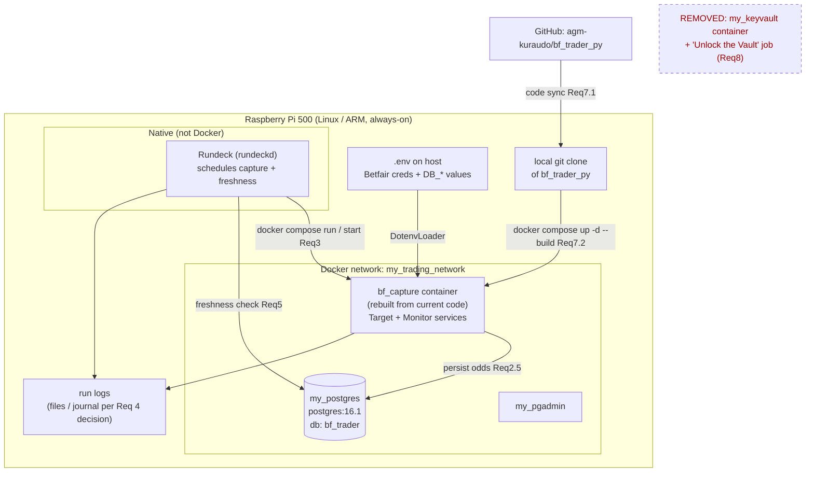
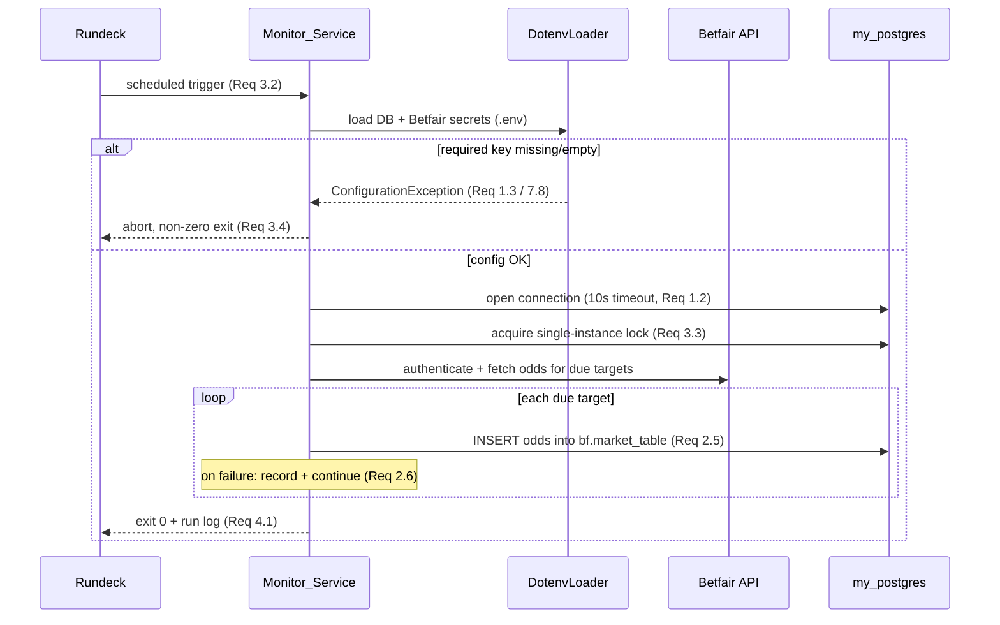
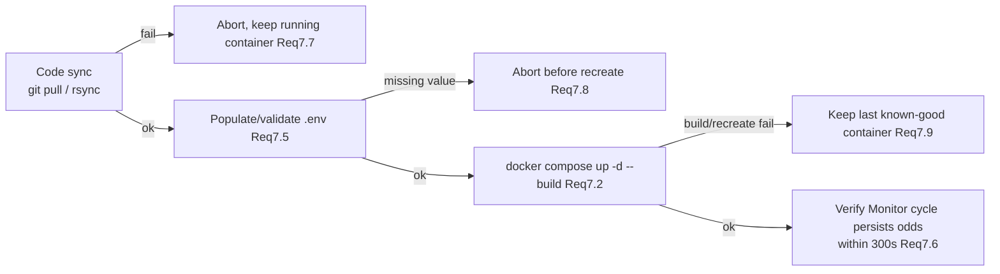

# Design Document

## Overview

This design stands up reliable **background Betfair data capture** for the running football season on the always-on Raspberry Pi 500 (Linux/ARM), under Jira ticket **SP-328**. Odds data is perishable, so the guiding principle is: get dependable capture running with the least change, and keep it that way.

The SP-329 spike established the facts this design builds on, so this design does **not** re-open them:

- **Root cause of the >1-year gap** is a legacy HashiCorp Vault connectivity failure at startup (the ~15-month-old baked image reaches host `my_vault`; the running container is `my_keyvault` on the wrong network), raised in `BFDriver.__init__` before any DB write.
- **Vault has already been removed from the codebase** in favour of `api.auth.dotenv_loader.DotenvLoader`, but the running artefact is a stale Docker image that has never been rebuilt.
- **PostgreSQL is fine**: it runs as the container `my_postgres` (`postgres:16.1`) on `my_trading_network`, database `bf_trader`, and is reachable.
- **Rundeck is fine**: it runs natively on the Pi and its jobs fire on schedule; only the capture job's dependencies were broken.

Given that, the fix is **rebuild-not-repair**. The design therefore covers five practical outcomes, mapping to the eight requirements:

1. **Confirm the data store** is running, reachable, and schema-ready (Req 1).
2. **Define and run minimum viable capture** — the existing `Target_Service` → `Monitor_Service` `MATCH_ODDS` flow on documented cadence tiers, running unattended on the Pi (Req 2).
3. **Restore a repeatable build/deploy pipeline** (docker-compose `up -d --build`) so current code actually runs, replacing the `docker start`-only pattern (Req 7), and **point the retained Rundeck job at it** (Req 3).
4. **Add visibility and freshness verification** so silent stalls are detectable (Req 4, Req 5).
5. **Retire Vault** — remove the `my_keyvault` container and the "Unlock the Vault" Rundeck job (Req 8), and **document** check/restart in Confluence (Req 6).

### Anti-over-engineering stance

This is a solo, learning-adjacent side project capturing perishable data. The design deliberately favours the simplest reliable option at every choice: reuse the existing containers, schema, services, and Rundeck; add small, self-contained scripts rather than new services or frameworks; and store deploy configuration in version control via one `docker-compose.yml`. No new scheduler, no new datastore, no notification platform beyond what the visibility decision (Req 4) settles on.

## Architecture

### Deployment topology (target state on the Pi)

Key points versus the current broken state: the capture container is **recreated from current code** (no Vault), Rundeck **runs the compose-managed container** instead of `docker start bf_monitor_service`, and the Vault container plus its unlock job are **gone**.

### Capture run flow (unchanged logic, now actually executing)

### Deploy flow (Req 7)

## Components and Interfaces

The design adds a small number of thin, single-purpose artefacts and reuses everything that already works. Nothing here introduces a new long-running service.

### Existing components reused as-is

| Component | Role | Requirement |
|---|---|---|
| `target_service.py` / `monitor_service.py` | The `MATCH_ODDS` capture flow (identify targets, poll odds, persist) | Req 2 |
| `DotenvLoader` (`api/auth/dotenv_loader.py`) | Loads secrets from `.env`; raises `ConfigurationException` on missing/empty keys | Req 1.3, 7.8 |
| `DBOutputConnection` (`output/dboutput.py`) | psycopg2 connection + read/write helpers | Req 1, 2.5 |
| `DefaultStrategy.UPDATE_FREQUENCY_TIERS` (`logic/simpleStategy.py`) | Cadence tier config selected by time-to-event | Req 2.2 |
| `my_postgres` container | Data store on `my_trading_network` | Req 1.6 |
| Native Rundeck | Scheduler | Req 3 |

### New / modified artefacts

1. **`docker-compose.yml`** (new, at repo root) — Req 7.2, 7.3
   - Defines a single `bf_capture` service built from `build/betfair_app.dockerfile`, attached to the external `my_trading_network`, reading `.env`, with a fixed container name. Stores network/env/name config in version control.
   - Interface: `docker compose up -d --build` (rebuild + recreate), `docker compose run --rm bf_capture python monitor_service.py` (one-shot capture run).

2. **`scripts/deploy.sh`** (new) — Req 7.1, 7.2, 7.4–7.9
   - Ordered steps: code sync → validate `.env` → `docker compose up -d --build` → post-deploy verification. Each failure mode returns a distinct non-zero exit and leaves the last known-good container in place.
   - Cross-platform note: authored for Linux/ARM (the Pi is the only deploy host per Req 2.4). A `.ps1` sibling is **not** required because the work PC is explicitly not the capture host; this limitation is called out rather than solved.

3. **`scripts/verify_db.py`** (new) — Req 1.1–1.5, 1.7
   - Reads DB connection details from `.env` via `DotenvLoader`, opens a connection with a **10-second timeout**, confirms the four required tables (`bf.target`, `bf.market_table`, `bf.log_file`, `bf.betfair_object_ids`) exist, and **creates only absent tables** from `build/sql/create_database.sql` DDL, leaving existing tables untouched.
   - Interface (return contract): `{ reachable: bool, missing_config: [keys], missing_tables: [names], created_tables: [names], error: str|None }`.

4. **`scripts/check_freshness.py`** (new) — Req 5
   - Queries `MAX("timestamp")` from `bf.market_table`, reports the most recent record timestamp and elapsed seconds, and raises a stall alert when elapsed exceeds the 15-minute threshold, when the store is unreachable, or when no records exist.
   - Scheduled by Rundeck at a fixed interval ≤ 15 minutes (Req 5.1).

5. **Rundeck job changes** — Req 3.5, 8.3
   - Capture job updated to invoke the compose-managed container (via `deploy.sh` / `docker compose`) instead of `docker start bf_monitor_service`.
   - New freshness-check job on the ≤15-minute cadence.
   - "Unlock the Vault" job **disabled and deleted**; no longer invokes `start_up_vault.sh`.

### Pure logic extracted for testability

The following pure functions carry the logic that the correctness properties target. They are extracted (or already extracted, e.g. `select_tier` in the existing tests) so they can be property-tested without I/O:

- `select_tier(tiers, time_until_start) -> int` — cadence tier selection (already exists in tests; formalise in `logic`).
- `validate_env(values: dict, required: list) -> list[str]` — returns the list of missing/empty required keys.
- `missing_tables(present: set, required: set) -> set` — set difference for schema readiness.
- `freshness(now, last_record_ts, threshold_s) -> {elapsed_s, stalled: bool}` — elapsed-time and stall decision.

## Visibility and Failure Detection Decision (Req 4.5)

**Decision (2026-09-01): Logs only -- Rundeck run history plus `bf.log_file`.** No
new notification platform is introduced, in line with the epic's simplest-reliable-option stance.

Rationale and mechanism:

- **Durable run record (Req 4.1, 4.2):** each capture run writes start, end, and
  outcome to `bf.log_file` in Postgres with a server `NOW()` timestamp --
  `"Monitor Service: INFO: Starting run"`, `"... Ending run successfully"`, and,
  on failure, `"... ERROR : Ending run with failure : <reason>"` written by the
  top-level handler before the non-zero exit. This is the single durable,
  queryable record and is retained for the life of the database (>= 30 days, Req 4.6).
- **Operator-facing failure/missed-run visibility (Req 4.3, 4.4):** Rundeck's
  per-run history captures each run's stdout and exit status. A non-zero exit
  (Req 3.4) surfaces in the Rundeck run log without inspecting internal state.
  A missed/never-started run is caught by the freshness check (Req 5): stale
  data raises a stall alert even if a run never fired.
- **Single documented location (Req 4.6):** the Rundeck job history (per-run
  logs + status) is the primary operator location; `bf.log_file` is the durable
  backing store. Both are documented in the Confluence runbook (Req 6).
- **Not chosen:** a push-notification platform (email/webhook) -- deferred as
  over-engineering for now; the freshness stall alert + Rundeck history cover
  detection. Persisting the container file log to a host volume was also not
  required, since `bf.log_file` already provides the durable record (the
  in-container `log/runlogYYMMDD.log` is ephemeral under `--rm` and is treated as
  best-effort debug output only).

## Freshness Threshold Decision (Req 5.1/5.3 refinement)

**Decision (2026-09-01): cadence-aware freshness threshold, not a flat 15 minutes.**

Req 5.1/5.3 state a 15-minute threshold, but the capture cadence is tiered by
time-to-event (IN_PLAY 5s ... MORE_THAN_12H 14400s). When the nearest match is
days away, targets legitimately update only every ~4 hours, so a flat 15-minute
threshold fires a false STALL every 15 minutes for days (observed live on
2026-09-01: a normal 63-minute gap was flagged as a stall). That is alert
fatigue, which would make the check worthless.

The threshold is therefore derived from the TIGHTEST `update_frequency` among
active (`OPEN`/`IDENTIFIED`) targets, plus a grace margin (`GRACE_S`, 5 min) for
scheduling jitter and run duration (`logic.deploy_checks.expected_freshness_threshold`).
This keeps the check:

- **Sharp near kick-off:** an in-play target (5s cadence) still trips within a
  few minutes -- a genuine in-play stall is caught fast.
- **Quiet when idle:** with only far-out targets (4h cadence), only a >4h gap
  alerts. With NO active targets, nothing should be landing, so no staleness
  alert is raised at all (reported as `idle`), and the empty-store alert (Req
  5.5) is likewise scoped to when active targets exist.

The 15-minute figure is retained as the Rundeck job *cadence* (how often the
check runs, Req 5.1) and as `DEFAULT_THRESHOLD_S` fallback; it is the *stall
threshold* that becomes cadence-aware. An explicit `threshold_s` can still be
passed (used by tests). This is a deliberate refinement of the literal Req
5.1/5.3 wording, agreed with the operator.

## Data Models

The database schema is **unchanged** by this feature. The data model below documents the four required capture tables (from `build/sql/create_database.sql`) that Req 1.4 requires to be confirmed present. These are the enumerated "required capture tables".

### `bf.target`

| Column | Type | Notes |
|---|---|---|
| `target_id` | text | Identity of a monitored market |
| `event_id` | text | Betfair event id |
| `market_id` | text | Betfair `MATCH_ODDS` market id |
| `runner_ids` | text | Pipe-delimited `id-name` runners |
| `start_time` | timestamptz | Event kick-off; drives tier selection |
| `status` | text | `IDENTIFIED` / `OPEN` / `CLOSED` / `EXPIRED` |
| `update_frequency` | integer | Seconds between updates (tier value) |
| `last_updated` | timestamptz | Last odds poll for this target |
| `notes` | text | Market description JSON |

### `bf.market_table` (the perishable odds record)

| Column | Type | Notes |
|---|---|---|
| `timestamp` | timestamptz | When odds were captured — the freshness signal (Req 5) |
| `market_id` | text | Market the odds belong to |
| `runner_id` | text | Selection id |
| `odds` | text | JSON-encoded exchange odds |

### `bf.log_file`

| Column | Type | Notes |
|---|---|---|
| `id` | uuid | Run id (single-instance lock + run tracing) |
| `timestamp` | timestamptz | Log event time |
| `message` | text | Run start/end and error markers (Req 4) |

### `bf.betfair_object_ids`

| Column | Type | Notes |
|---|---|---|
| `object_type` | text | e.g. `event-type`, `competition` |
| `object_name` | text | Human name |
| `object_id` | integer | Betfair id |
| `last_updated` | timestamptz | Refresh time |

### Configuration model (`.env` on the host)

Required keys (Req 7.5, 7.8): `BF_AppKey`, `BF_USERID`, `BF_PWD`, `BF_CRT_FILE`, `BF_KEY_FILE`, `DB_HOST=my_postgres`, `DB_PORT`, `DB_NAME=bf_trader`, `DB_USER`, `DB_PWD`. Loaded via `DotenvLoader`; secrets do not leak into `os.environ`. **No Vault keys exist in this model** (Req 8.4).

### Cadence tier model (Req 2.2)

Named tiers selected by time-to-event, each mapping to a fixed interval, so two readers pick the same interval for the same time-to-event:

| Tier | Condition (time to start) | Interval (s) |
|---|---|---|
| `IN_PLAY` | started (≤ 0) | 5 |
| `LESS_THAN_3H` | ≤ 3h | 300 |
| `LESS_THAN_6H` | ≤ 6h | 900 |
| `LESS_THAN_12H` | ≤ 12h | 3600 |
| `MORE_THAN_12H` | > 12h | 14400 |

## Correctness Properties

*A property is a characteristic or behavior that should hold true across all valid executions of a system-essentially, a formal statement about what the system should do. Properties serve as the bridge between human-readable specifications and machine-verifiable correctness guarantees.*

The pure functions extracted in *Components and Interfaces* (`select_tier`, `validate_env`, `missing_tables`, `freshness`) carry the logic these properties target, so they can be property-tested without I/O. Two further invariants (deploy atomicity and Vault-absence) are stated as properties because they must hold across every failure point / every artifact respectively. Everything else (real DB reachability, Rundeck timing, persistence) is verified by integration or example tests — see *Testing Strategy*.

### Property 1: Freshness stall decision is exact and elapsed time is non-negative

*For any* `now`, any `last_record_ts` with `last_record_ts <= now`, and any positive `threshold_s`, `freshness(now, last_record_ts, threshold_s)` SHALL return `elapsed_s == (now - last_record_ts)` with `elapsed_s >= 0`, and `stalled == (elapsed_s > threshold_s)`. When `last_record_ts` is absent (no records exist), the result SHALL be `stalled == True`.

**Validates: Requirements 5.2, 5.3, 5.5**

### Property 2: Environment validation returns exactly the missing or empty keys

*For any* dict of configuration `values` and any list of `required` keys, `validate_env(values, required)` SHALL return exactly the set of required keys that are absent from `values` or whose value is empty/whitespace-only, and SHALL return an empty list if and only if every required key is present with a non-empty value.

**Validates: Requirements 1.3, 7.8**

### Property 3: Missing-tables is exact set difference

*For any* set of `present` table names and any set of `required` table names, `missing_tables(present, required)` SHALL equal `required - present`, and SHALL be empty if and only if `required` is a subset of `present`. Only tables in this result are created; tables already present are never re-created.

**Validates: Requirements 1.4, 1.5**

### Property 4: Cadence tier selection is total and monotonic

*For any* `time_until_start`, `select_tier(tiers, time_until_start)` SHALL return a defined tier interval (totality). *For any* two times `t1 <= t2`, the interval selected for `t1` SHALL be less than or equal to the interval selected for `t2` (monotonicity): as an event gets closer, the update interval never gets longer. Consequently two readers picking a tier for the same time-to-event always get the same interval.

**Validates: Requirements 2.2**

### Property 5: Deploy is atomic — a failed step leaves the running container unchanged

*For any* deploy step that fails (code-sync, `.env` validation, image build, or container recreation), the previously running capture container's identity and running state SHALL be unchanged after the deploy aborts, and the deploy SHALL return a non-zero result identifying the failed step. No partial recreation ever replaces a known-good container.

**Validates: Requirements 7.7, 7.8, 7.9**

### Property 6: No design or configuration artifact references Vault

*For any* design or deploy/config artifact in scope (`design.md`, `docker-compose.yml`, `.env` template, deploy/verify scripts, Rundeck job definitions produced by this feature), the artifact SHALL contain no Vault service, host, network, or name reference — specifically no `my_vault`, no `my_keyvault`, and no Vault network wiring.

**Validates: Requirements 8.4**

## Error Handling

Error handling favours fail-safe defaults: never enable capture on an unconfirmed store, never replace a known-good container with a broken one, and never let one target's failure abort a whole run. Each path below states the trigger and the required behaviour.

| # | Error path | Trigger | Required behaviour |
|---|---|---|---|
| E1 | Missing/empty `.env` values | Any required key (Betfair creds, `DB_HOST`, `DB_PORT`, `DB_NAME`, `DB_USER`, `DB_PWD`) absent or empty | `validate_env` returns the offending keys; capture treated as **not stood up**; deploy **aborts before container recreation**; operator error names the missing keys. (Req 1.3, 7.8) |
| E2 | Data_Store unreachable | No connection within the **10-second** timeout | Capture left **disabled**; operator error indicates the store is unreachable. Freshness check raises an unreachable alert and **retains the last successful check timestamp**. (Req 1.7, 5.4) |
| E3 | Per-target persist failure | `INSERT` into `bf.market_table` fails for one target | Failure **recorded** (run log / `bf.log_file`); run **continues** with remaining targets; run does **not** terminate. (Req 2.6) |
| E4 | Concurrent run | Scheduled trigger fires while a prior invocation still holds the single-instance lock | New invocation **skipped** and the skip **recorded**; no overlapping executions. (Req 3.3) |
| E5 | Non-zero capture exit | Capture invocation exits non-zero (config error, auth failure, etc.) | Failure **recorded** with timestamp and exit status; defined cadence **unchanged** so the next scheduled trigger still fires. (Req 3.4) |
| E6 | Code-sync failure | `git pull` / `rsync` cannot retrieve current code | Deploy **aborts**; previously running container **unchanged**; error indicates the sync failure. (Req 7.7) |
| E7 | Build / recreate failure | Image build or container recreation fails | **Last known-good** container retained and left running; error indicates the build/recreation failure. (Req 7.9) |
| E8 | Freshness stall | Elapsed since most recent odds record exceeds **15 minutes**, or the store contains **no** records | **Stall alert** to operator identifying the affected data source and elapsed time (or that no captured odds are present). (Req 5.3, 5.5) |
| E9 | Vault removal guard | Operator attempts to remove `my_keyvault` before a Vault-free run is confirmed | Removal **not permitted** until current code is confirmed running without any Vault dependency (Req 7.4). Once confirmed, the container and the "Unlock the Vault" job are removed. (Req 8.1, 8.2) |

`ConfigurationException` from `DotenvLoader` is the single source of truth for E1: it is raised before any DB or Betfair work, mirroring how the retired Vault path used to fail — but now on a recoverable, operator-actionable condition.

## Testing Strategy

**Dual approach.** Pure logic is covered by property-based tests; I/O, infrastructure, and end-to-end behaviour by integration/example tests. This keeps the property suite fast and deterministic while still verifying the real deployment.

### Property-based tests (Hypothesis)

Hypothesis is already used in this repo, so no new framework is introduced. Each property below maps to a single property-based test, minimum **100 iterations**, tagged with a comment referencing the design property.

Tag format: `# Feature: season-background-data-capture, Property {number}: {property_text}`

| Property | Function under test | Generators |
|---|---|---|
| Property 1 (freshness) | `freshness(now, last_record_ts, threshold_s)` | datetimes with `last_ts <= now`, positive thresholds, plus the `None` last-record case |
| Property 2 (validate_env) | `validate_env(values, required)` | random key sets; values including empty/whitespace strings and extra keys |
| Property 3 (missing_tables) | `missing_tables(present, required)` | random string sets for present/required |
| Property 4 (select_tier) | `select_tier(tiers, time_until_start)` | random time-to-event values incl. negative (in-play) and boundary values |
| Property 5 (deploy atomicity) | deploy step orchestration | staged failures injected at each step against a recorded container id/state |
| Property 6 (Vault-absence) | artifact scan | scans the in-scope artifact set for `my_vault` / `my_keyvault` / Vault wiring |

### Unit / example tests

- Per-target persist failure (E3): mock `DBOutputConnection` to fail one target; assert the run continues and records the failure (Req 2.6).
- Single-instance lock (E4): acquire the lock, attempt a second invocation, assert it is skipped and recorded (Req 3.3).
- Deploy abort ordering: assert deploy aborts **before** recreation when `.env` validation fails (Req 7.8).
- Vault removal guard (E9): assert removal is refused until a Vault-free run is confirmed (Req 8.1, 8.2).

### Integration tests (require the `my_postgres` container)

- `verify_db`: connect within the 10-second timeout, confirm the four required tables, and create only absent tables; run twice to assert existing tables/data are untouched (Req 1.2, 1.4, 1.5, 1.7).
- `check_freshness`: against a store with/without recent records and an unreachable store; assert correct reporting and alerts (Req 5.2, 5.3, 5.4, 5.5).
- **Post-deploy verification (Req 7.6):** after `docker compose up -d --build`, assert a Monitor cycle runs current code and persists an odds row to `bf_trader` **within 300 seconds**. This also satisfies Req 7.4 by confirming the absence of the Vault startup failure.
- Vault-related tests assert **Vault is absent**: no `my_keyvault` container remains and no "Unlock the Vault" job is scheduled (Req 8.1, 8.3).

### Scheduler / visibility checks

Rundeck timing (Req 3.2), run-log entries and failure/missed-run detection (Req 4) are verified by observed Rundeck runs and log inspection rather than property tests — these are external-tool behaviours, not input-varying logic.

### Platform note

The pure-logic property and unit tests are cross-platform (plain Python) and run on both the Windows work PC and the Pi. The **integration and post-deploy tests, and the deploy scripts, target Linux/ARM only** because the Raspberry Pi 500 is the sole capture host (Req 2.4); the work PC is explicitly not the capture host and powers off daily. This is a deliberate limitation, not an oversight: a `.ps1` deploy sibling is not provided because it would have no host to run against. If a Windows capture host were ever needed, a PowerShell deploy script and Windows-side container tooling would be required.

## Requirements Coverage

| Requirement | Satisfied by (design elements) |
|---|---|
| **1 — Data Storage Prerequisite** | `scripts/verify_db.py` (10s-timeout connect, required-table check, create-only-absent); `missing_tables` / `validate_env` pure functions; Data Models (four required tables); Architecture notes `my_postgres` on `my_trading_network` (Req 1.6); Property 2, Property 3; E1, E2; integration tests for verify_db. |
| **2 — Minimum Viable Capture** | Reuse of `target_service`/`monitor_service` `MATCH_ODDS` flow; Cadence tier model + `select_tier` (Req 2.2); capture runs on the Pi via Rundeck (Req 2.3, 2.4, 2.7, 2.8); persist-and-continue error path E3; Property 4; capture run-flow sequence diagram. |
| **3 — Scheduling (retain Rundeck)** | Architecture (native Rundeck retained); Rundeck job changes pointing at the compose-managed container; single-instance lock E4 (Req 3.3); non-zero-exit bookkeeping E5 (Req 3.4); deploy flow diagram. |
| **4 — Visibility & Failure Detection** | Run logs to files/journal + `bf.log_file`; E5 (recorded failures); freshness check as missed-run/stall signal; visibility-approach decision recorded in the design (Req 4.5); scheduler/visibility test notes. |
| **5 — Recurring Data Verification** | `scripts/check_freshness.py` + `freshness` pure function; Rundeck freshness job at ≤15-min cadence; Property 1; E2, E8; freshness integration tests. |
| **6 — Documentation** | Confluence status-check + ordered restart procedure and SP-328 link (documented as the check/restart note referenced in the Overview); ties to visibility decision in Req 4. |
| **7 — Build & Deploy Pipeline** | `docker-compose.yml`; `scripts/deploy.sh` (sync → validate `.env` → `up -d --build` → verify); atomicity/rollback E1/E6/E7; Property 5; `.env` configuration model (Req 7.5); post-deploy 300s verification test (Req 7.6). |
| **8 — Vault Retirement** | Removal of `my_keyvault` + "Unlock the Vault" job guarded by confirmed Vault-free run (E9); Property 6 (no Vault reference in artifacts); Architecture explicitly marks Vault REMOVED; scope limited to container + job per Req 8.5. |
